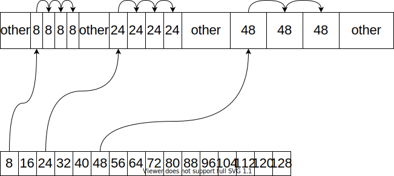

&emsp;&emsp;建议看为《深入探索C++对象模型》再看。
&emsp;&emsp;STL中的类似于一般的内存管理组件，allocator作为STL大部分组件的一部分工作在底层。一般的对象创建工作分为对象的内存分配和对象的构造，这两个步骤一般是一同进行的。allocator将两个过程分离使得用户构造的类的实例的内存可控。

# 1 SGI的标准置配器
&emsp;&emsp;SGI定义了一个符合C++标准的空间配置器allocator，但是因为性能问题基本不使用。该空间配置器只是简单的对C++提供的```::operator new```和```::operator delete```包装了一下而已，并未做特别的优化处理。
```cpp
/*
 * @file    defalloc.h
 * @brief   allocate和deallocate只是简单的对全局new和delete的封装
 */
template <class T>
inline T* allocate(ptrdiff_t size, T*) {
    set_new_handler(0);
    T* tmp = (T*)(::operator new((size_t)(size * sizeof(T))));
    if (tmp == 0) {
	cerr << "out of memory" << endl; 
	exit(1);
    }
    return tmp;
}

template <class T>
inline void deallocate(T* buffer) {
    ::operator delete(buffer);
}

template <class T>
class allocator {
public:
    typedef T value_type;
    typedef T* pointer;
    typedef const T* const_pointer;
    typedef T& reference;
    typedef const T& const_reference;
    typedef size_t size_type;
    typedef ptrdiff_t difference_type;
    pointer allocate(size_type n) { 
	return ::allocate((difference_type)n, (pointer)0);
    }
    void deallocate(pointer p) { ::deallocate(p); }
    pointer address(reference x) { return (pointer)&x; }
    const_pointer const_address(const_reference x) { 
	return (const_pointer)&x; 
    }
    size_type init_page_size() { 
	return max(size_type(1), size_type(4096/sizeof(T))); 
    }
    size_type max_size() const { 
	return max(size_type(1), size_type(UINT_MAX/sizeof(T))); 
    }
};
```

# 2 SGI STL中的空间置配器
&emsp;&emsp;SGI STL包含于头文件```<memory>```中，其涉及的文件有：
- ```<stl_construct.h>```:  定义了全局的```construct```和```destruct```函数，负责对对象进行构造和析构，并针对不同的情况进行优化；
- ```<stl_alloc.h>```: 定义了stl使用的一二级空间置配器，分别针对不同的应用场景管理内存；
- ```<stl_uninitialized.h>```: 定义了一些全局函数用来填充或者是拷贝大块的内存，提升性能。

## 2.1 对象的构造和析构
&emsp;&emsp;STL针对构造和析构的性能优化主要是，判断构造函数是```trivial```还是```non-trivial```的。如果函数构造或者析构函数是trivial则意味着编译器只为对象分配相关的内存，而并不做具体的构造或者析构工作，否则会生成默认的构造函数或者扩展现有的构造函数，保证对一些特殊数据的初始化工作，如何判断，构造函数或者析构函数是trivial，如果输入如下四种情况则为non-trivial，反之为trivial:
1. 带有default constructor的类成员：当当前类拥有一个成员变量，而该变量是一个拥有显式声明的default constructor的类时，编译器为了初始化该类会自动声明一个default constructor，并在自动生成的default constructor中调用该类的构造函数。
    - 如果当前类并未声明任何构造函数，则编译器声明一个default constructor，并在该构造函数中初始化成员类；
    - 如果当前类包含多个已经声明的构造函数，则编译器会扩张已经存在的每一个构造函数，并在用户代码之前调用类成员的default constructor;
2. 如果当前类中包含多个类成员变量，则编译器会按照各个类成员声明的顺序在自动生成的构造函数中调用类成员的default constructor或者扩张已经存在的constructor;
3. 带有default constructor的基类：如果当前类继承体系中，其祖先类中存在一个包含default constructor的类，则为了初始化该类编译器会生成default constructor并插入相关初始化代码，如果存在则选择扩张constructor;
4. 带有virtual function的类：当前类包含一个虚函数或者继承自包含虚函数的类，即类最终包含一个虚函数表指针。编译器生成的default constuctor或者扩张constructor的目的是初始化虚函数表和虚函数指针，基本行为和上面的类似。


当前类虚继承自另一个类：虚继承涉及到了比较复杂的机制，他会在构造函数参数列表中生成一个bool类型变量，只有在顶层子类中，才会通过bool类型量实例化一次虚基类中的对象，以此实现虚基类机制。
&emsp;&emsp;针对对象的构造，因为构造函数调用的工作由编译器完成，因此不需要做具体的处理，编译器完全能够针对不同的情况进行优化，但是因为在析构时需要显示的调用析构函数导致，可能析构函数必被调用，因此STL针对不同情况进行了处理。能够看到的是STL实现了四个版本的```destroy```:
1. 针对```char*```的特化版本；
2. 针对```w_char*```的特化版本；
3. 针对指针类型的特化版本；
4. 针对迭代器的实现版本：
    - 如果析构函数为```trivial```，则什么都不做；
    - 如果析构函数为```non-trivial```，则显示调用析构函数。

&emsp;&emsp;另外，针对对象是否为```trivial destructor```，使用```__type_traits```进行判断。

```cpp
/*
 * @brief 对象构造工具，对于trivial的构造函数的调用与否由编译器决定，因此不用像destroy那样定义多个版本
 */
template <class T1, class T2>
inline void 
construct(T1* p, const T2& value)
{  
	new (p) T1(value);
}

/*
 * @brief 原始版本接受一个指针，显示调用对象的析构函数
 */ 
template <class T>
inline void destroy(T* pointer) 
{  			
    pointer->~T();
}

/*
 * @brief 针对一组元素进行析构，如果该对象的析构函数是non-trivial的，则直接调用析构函数
 */
template <class ForwardIterator>
inline void __destroy_aux(ForwardIterator first, ForwardIterator last, __false_type) 
{
	for ( ; first < last; ++first)
		destroy(&*first);
}

/*
 * @brief 针对一组元素进行析构，如果对象的析构函数是trivial的，则什么都不用做
 */
template <class ForwardIterator> 
inline void 
__destroy_aux(ForwardIterator, ForwardIterator, __true_type) {}


/*
 * @brief 对一组元素进行析构，在此判断该对象的析构函数是否为trivial的
 */
template <class ForwardIterator, class T>
inline void 
__destroy(ForwardIterator first, ForwardIterator last, T*) 
{
	typedef typename __type_traits<T>::has_trivial_destructor trivial_destructor;
	__destroy_aux(first, last, trivial_destructor());
}


/* 
 * 针对一组对象进行析构，接受两个迭代器，此函数设法找出元素的数值型别，进而利用 __type_traits<>求取最适当措施
 */
template <class ForwardIterator>
inline void 
destroy(ForwardIterator first, ForwardIterator last) 
{
	__destroy(first, last, value_type(first));
}


/*
 * @brief 针对迭代器为char* 和 wchar_t* 的特化版，什么都不用做
 */
inline void destroy(char*, char*) {}
inline void destroy(wchar_t*, wchar_t*) {}
```
## 2.2 一二级空间置配器
&emsp;&emsp;STL的空间置配器进行了简单的封装，这也是基本大多数容器采用的空间置配器。
```cpp
/*
 * @brief 只是针对对象分配和销毁函数的简单封装
 */
template<class T, class Alloc>
class simple_alloc 
{
public:
    static T *allocate(size_t n)
    { 
		return 0 == n? 0 : (T*) Alloc::allocate(n * sizeof (T)); 
	}
    static T *allocate(void)
    { 	
		return (T*) Alloc::allocate(sizeof (T)); 
	}
    static void deallocate(T *p, size_t n)
    { 	
		if (0 != n) 
			Alloc::deallocate(p, n * sizeof (T)); 
	}
    static void deallocate(T *p)
    { 
		Alloc::deallocate(p, sizeof (T)); 
	}
};
```
&emsp;&emsp;STL针对不同的内存分配情况，对内存配置进行分情况管理。针对当前用户请求的空间大小，STL采取不同的策略：
- 如果用户申请的内存小于等于```__MAX_BYTES```，则采用第二级置配器，该置配器采用内存池对不同大小的内存块做管理；
- 如果用户申请的内存大于```__MAX_BYTES```，则采用第一级置配器，该置配器直接采用```malloc```和```free```进行内存管理。

### 2.2.1 第一级置配器 
&emsp;&emsp;第一级置配器比较简单就是对```malloc```和```free```的简单封装，需要注意的是当内存分配失败时的处理方式，即```oom_malloc```，该函数的实现会不断尝试分配内存直到分配成功为止，或者由用户提供```__malloc_alloc_oom_handler```处理函数，针对内存分配失败进行相应的应对。

```cpp
/*
 * @brief 一级置配器，负责申请和分配大块内存
 */
template <int inst>
class __malloc_alloc_template 
{

private:

	static void *oom_malloc(size_t);
	static void *oom_realloc(void *, size_t);

#ifndef __STL_STATIC_TEMPLATE_MEMBER_BUG
    static void (* __malloc_alloc_oom_handler)();
#endif

public:
    //对malloc的简单封装，如果申请失败则调用另一个内存分配处理程序尝试分配内存
	static void * allocate(size_t n)
	{
		void *result = malloc(n);
		if (0 == result) result = oom_malloc(n);
		return result;
	}

	static void deallocate(void *p, size_t /* n */)
	{
		free(p);
	}

    //和allocate，只是针对realloc版本
	static void * reallocate(void *p, size_t /* old_sz */, size_t new_sz)
	{
		void * result = realloc(p, new_sz);
		if (0 == result) result = oom_realloc(p, new_sz);
		return result;
	}

    //malloc内存分配错误处理程序
	static void (* set_malloc_handler(void (*f)()))()
	{
		void (* old)() = __malloc_alloc_oom_handler;
		__malloc_alloc_oom_handler = f;
		return(old);
	}
};
```

### 2.2.2 第二级置配器
&emsp;&emsp;第二级置配器是使用内存池的方式管理一系列的空闲内存链表来供用户使用。该内存置配器维护了一个数组，数组的每一个元素是一个链表，数组中从```0~n```个单元，依次按照```ALIGN```的尺寸维护多个单链表，每个单链表的指针指向一块对应尺寸的空闲内存，比如第0个元素就是8byte的单链表，第1个元素就是16byte的单链表，最后一个是128byte的单链表。而该但链表的数据结构定义为：
```cpp
//内部小内存空间的管理单元
	union obj {
        union obj * free_list_link;
        char client_data[1];    /* The client sees this.        */
	};
```
&emsp;&emsp;通过```union```可以减少对空间的需求。


&emsp;&emsp;下面是具体的实现代码，能够看到的是，当用户需要申请一块内存时，分配器将用户申请的内存进行对齐，对齐的倍数为```__ALIGN```默认为8，即如果用户申请22，则对齐到24，之后分配器会尝试从空闲链表中取出对应空闲块：
- 如果存在空闲块，则分配器从空闲链表中取下头结点，修改链表的头结点；
- 如果不存在，则尝试从内存池上再分配空闲结点。

&emsp;&emsp;而内存的销毁很简单就是将对应的内存块插入到对应的空闲链表的头部，即头插。

```cpp
/*
 * @brief 第二级空间置配器，管理较小的内存块
 */
template <bool threads, int inst>
class __default_alloc_template 
{

private:
  // Really we should use static const int x = N
  // instead of enum { x = N }, but few compilers accept the former.
# ifndef __SUNPRO_CC
    enum {__ALIGN = 8};                                     //内存对齐，如果用户提供的内存大小不是8的倍数，则向上对齐到8的倍数
    enum {__MAX_BYTES = 128};                               //使用第一级还是第二级置配器的判断边界
    enum {__NFREELISTS = __MAX_BYTES/__ALIGN};              //内存的数量
# endif
    //向上对齐函数
	static size_t ROUND_UP(size_t bytes) 
	{
		return (((bytes) + __ALIGN-1) & ~(__ALIGN - 1));
	}
__PRIVATE:
    //内部小内存空间的管理单元
	union obj {
        union obj * free_list_link;
        char client_data[1];    /* The client sees this.        */
	};
private:
# ifdef __SUNPRO_CC
    static obj * __VOLATILE free_list[]; 
        // Specifying a size results in duplicate def for 4.1
# else
    static obj * __VOLATILE free_list[__NFREELISTS];        //实际上的空间数组，数组中每一个元素是一个链表
# endif
    //
	static  size_t FREELIST_INDEX(size_t bytes)             //根据当前分配的内存块大小，找到具体的内存结点索引
	{
        return (((bytes) + __ALIGN-1)/__ALIGN - 1);
	}

  // Returns an object of size n, and optionally adds to size n free list.
	static void *refill(size_t n);
  // Allocates a chunk for nobjs of size "size".  nobjs may be reduced
  // if it is inconvenient to allocate the requested number.
	static char *chunk_alloc(size_t size, int &nobjs);

  // Chunk allocation state.
	static char *start_free;                            //内存池起始位置
	static char *end_free;                              //内存池结束位置
	static size_t heap_size;                            //堆内存大小

# ifdef __STL_SGI_THREADS
    static volatile unsigned long __node_allocator_lock;
    static void __lock(volatile unsigned long *); 
    static inline void __unlock(volatile unsigned long *);
# endif

# ifdef __STL_PTHREADS
    static pthread_mutex_t __node_allocator_lock;
# endif

# ifdef __STL_WIN32THREADS
    static CRITICAL_SECTION __node_allocator_lock;
    static bool __node_allocator_lock_initialized;

public:
    __default_alloc_template() 
	{
	// This assumes the first constructor is called before threads
	// are started.
        if (!__node_allocator_lock_initialized) 
		{
            InitializeCriticalSection(&__node_allocator_lock);
            __node_allocator_lock_initialized = true;
        }
    }
private:
# endif
	class lock                                          //多线程相关的锁
	{
    public:
        lock() { __NODE_ALLOCATOR_LOCK; }
        ~lock() { __NODE_ALLOCATOR_UNLOCK; }
    };
	
    friend class lock;
	
public:

	/* n must be > 0      */
	static void * allocate(size_t n)
	{
		obj * __VOLATILE * my_free_list;
		obj * __RESTRICT result;

		if (n > (size_t) __MAX_BYTES)                               //如果申请的内存大于__MAX_BYTES则使用默认的malloc尝试分配大块内存
		{
			return(malloc_alloc::allocate(n));
		}

		my_free_list = free_list + FREELIST_INDEX(n);              
		// Acquire the lock here with a constructor call.
		// This ensures that it is released in exit or during stack
		// unwinding.
#       ifndef _NOTHREADS
        /*REFERENCED*/
        lock lock_instance;
#       endif
		result = *my_free_list;
		if (result == 0) 
		{
			void *r = refill(ROUND_UP(n));                          //获取空闲块失败从内存池上获取内存结点，
			return r;
		}

		*my_free_list = result -> free_list_link;                   //将内存块从空间链表上取出
		
		return (result);
	};

	/* p may not be 0 */
	static void deallocate(void *p, size_t n)
	{
		obj *q = (obj *)p;
		obj * __VOLATILE * my_free_list;

		if (n > (size_t) __MAX_BYTES) 
		{
			malloc_alloc::deallocate(p, n);
			return;
		}

		my_free_list = free_list + FREELIST_INDEX(n);
    // acquire lock
#       ifndef _NOTHREADS
        /*REFERENCED*/
        lock lock_instance;
#       endif /* _NOTHREADS */
		q -> free_list_link = *my_free_list;                        //并不会真的销毁，而是将空闲块添加到对应的空闲链表中。
		*my_free_list = q;
    // lock is released here
	}

	static void * reallocate(void *p, size_t old_sz, size_t new_sz);

};
```
&emsp;&emsp;```refill```函数在空闲链表无空闲结点时调用，尝试从内存池中获取内存，构建新的空闲结点，默认的结点数为20。
```cpp
template <bool threads, int inst>
void* __default_alloc_template<threads, inst>::refill(size_t n)
{
    int nobjs = 20;
    char * chunk = chunk_alloc(n, nobjs);
    obj * __VOLATILE * my_free_list;
    obj * result;
    obj * current_obj, * next_obj;
    int i;
    //如果结点=1则直接返回内存不需要修改空闲链表
    if (1 == nobjs) return(chunk);
    my_free_list = free_list + FREELIST_INDEX(n);

    /* Build free list in chunk */
    result = (obj *)chunk;
    *my_free_list = next_obj = (obj *)(chunk + n);
    //下面是从内存池返回的内存上构建结点修改空闲链表
    for (i = 1; ; i++) 
	{
        current_obj = next_obj;
        next_obj = (obj *)((char *)next_obj + n);   //调整指针
        if (nobjs - 1 == i) 
		{
            current_obj -> free_list_link = 0;
            break;
        }
		else 
		{
            current_obj -> free_list_link = next_obj;
        }
    }
    return(result);
}
```

&emsp;&emsp;尝试从内存池中获取分为：
- 如果空闲内存大于等于需要申请的内存，则调整左侧的指针，返回内存；
- 如果剩余的内存只够分配需要的空闲的内存的一个小块，则分配一个小块，返回；
- 如果剩余空闲内存不足，无法分配哪怕一个小块儿，则尝试扩充内存池，再分配新的结点，如果失败则尝试在比当前申请的大的链表中寻找空闲块，取下一个空闲块，拆分为多个小结点。

```cpp
template <bool threads, int inst>
char*
__default_alloc_template<threads, inst>::chunk_alloc(size_t size, int& nobjs)
{
    char * result;
    size_t total_bytes = size * nobjs;
    size_t bytes_left = end_free - start_free;

    if (bytes_left >= total_bytes)              //如果空闲内存大于等于需要申请的内存，则调整左侧的指针，返回内存
	{
        result = start_free;
        start_free += total_bytes;
        return(result);
    } 
	else if (bytes_left >= size)                //如果剩余的内存只够分配需要的空闲的内存的一个小块，则分配一个小块，返回
	{
        nobjs = bytes_left/size;
        total_bytes = size * nobjs;
        result = start_free;
        start_free += total_bytes;
        return(result);
    } 
	else                                        //如果剩余空闲内存不足，无法分配哪怕一个小块儿
	{
        size_t bytes_to_get = 2 * total_bytes + ROUND_UP(heap_size >> 4);       //扩大维护的堆空间
        // Try to make use of the left-over piece.
        if (bytes_left > 0)                                                     //如果还有未被使用的空间，则将该空间插入到对应的链表中，因为无论分配还是使用内存都是以ALIGN为边界的，能够保证内存本身的对齐
		{
            obj * __VOLATILE * my_free_list =
                        free_list + FREELIST_INDEX(bytes_left);

            ((obj *)start_free) -> free_list_link = *my_free_list;
            *my_free_list = (obj *)start_free;
        }
        start_free = (char *)malloc(bytes_to_get);                              //额外分配空间
        if (0 == start_free)                                                    //内存分配失败
		{
            int i;
            obj * __VOLATILE * my_free_list, *p;
            // Try to make do with what we have.  That can't
            // hurt.  We do not try smaller requests, since that tends
            // to result in disaster on multi-process machines.
            for (i = size; i <= __MAX_BYTES; i += __ALIGN)                      //尝试从比当前申请块大的链表中寻找空闲块，并对链表进行调整
			{
                my_free_list = free_list + FREELIST_INDEX(i);
                p = *my_free_list;
                if (0 != p) 
				{
                    *my_free_list = p -> free_list_link;
                    start_free = (char *)p;
                    end_free = start_free + i;
                    return(chunk_alloc(size, nobjs));
                    // Any leftover piece will eventually make it to the
                    // right free list.
                }
            }
			end_free = 0;	// In case of exception.
            start_free = (char *)malloc_alloc::allocate(bytes_to_get);          //无法找到空闲的内存，使用第一级空间置配器
            // This should either throw an
            // exception or remedy the situation.  Thus we assume it
            // succeeded.
        }

        heap_size += bytes_to_get;
        end_free = start_free + bytes_to_get;
        return (chunk_alloc(size, nobjs));                                      //对链表进行调整
    }
}
```

## 2.3 内存填充和拷贝工具
&emsp;&emsp;STL提供了几个对大块对象内存进行考别和初始化的全局函数：
- ```uninitialized_copy```：将一块空间初始化为一个对象的拷贝；
- ```uninitialized_copy_n```：和```uninitialized_copy```类似，参数不同；
- ```uninitialized_fill```：将一块空间填充为多个对象，每个对象以给定的参数为实际构造参数；
- ```uninitialized_fill_n```：和```uninitialized_fill```类似，参数不同;

&emsp;&emsp;不同版本的实现的优化方式类似对象的构造，针对```trivial```对象和非```trivial```进行优化。

&emsp;&emsp;这里只看```uninitialized_copy```的实现，其他类似，只是最终进行拷贝还是初始化调用api不同。
```cpp
/*
 * 拥有trivial constructor的类的拷贝
 */
template <class InputIterator, class ForwardIterator>
inline ForwardIterator 
__uninitialized_copy_aux(InputIterator first, InputIterator last,
                         ForwardIterator result,
                         __true_type) {
  return copy(first, last, result);
}

/*
 * 无trivial constructor的类的拷贝
 */
template <class InputIterator, class ForwardIterator>
ForwardIterator 
__uninitialized_copy_aux(InputIterator first, InputIterator last,
                         ForwardIterator result,
                         __false_type) {
  ForwardIterator cur = result;
  __STL_TRY {
    for ( ; first != last; ++first, ++cur)
      construct(&*cur, *first);
    return cur;
  }
  __STL_UNWIND(destroy(result, cur));
}


template <class InputIterator, class ForwardIterator, class T>
inline ForwardIterator
__uninitialized_copy(InputIterator first, InputIterator last,
                     ForwardIterator result, T*) {
  typedef typename __type_traits<T>::is_POD_type is_POD;
  return __uninitialized_copy_aux(first, last, result, is_POD());
}

template <class InputIterator, class ForwardIterator>
inline ForwardIterator
  uninitialized_copy(InputIterator first, InputIterator last,
                     ForwardIterator result) {
  return __uninitialized_copy(first, last, result, value_type(result));
}

inline char* uninitialized_copy(const char* first, const char* last,
                                char* result) {
  memmove(result, first, last - first);
  return result + (last - first);
}

inline wchar_t* uninitialized_copy(const wchar_t* first, const wchar_t* last,
                                   wchar_t* result) {
  memmove(result, first, sizeof(wchar_t) * (last - first));
  return result + (last - first);
}
```
&emsp;&emsp;能够看到的是和```allocator```实现方式类似，通过```__type_traits<T1>::is_POD_type```判断类是否为包含```trivial```，只不过这里为```is_POD_type```，意为Plain Old Data，即如果对象为POD数据对象必定含有trivial constructor。