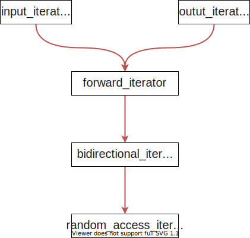

&emsp;&emsp;虽然说这里谈的是迭代器但是实际上大多数内容在谈论```traits```。
# 1 迭代器简介
&emsp;&emsp;迭代器（iterator），是确使用户可在容器对象（container，例如链表或数组）上遍历访问的对象，设计人员使用此接口无需关心容器对象的内存分配的实现细节。一般熟知的是迭代器模式，它提供了一种方法，使之能够按照顺序遍历容器中所包含的各个元素，而又不需要暴露对应容器内部的表示方式。
&emsp;&emsp;一般情况下，我们常用的指针就是一种迭代器，迭代器的行为更像一个智能指针，他能够和指针一样存取容器中的成员。为了实现这一功能，在C++中一般都对迭代器重载```operator *```和```operator->```两个操作符。但是在实际操作中很难做到完全不知道目标容器的实现细节而对其进行迭代器操作，除非这些容器能够遵循统一的实现接口，保证迭代器能够有效的获取元素，比如数组的下一个元素直接将下标+1即可，但是链表的下一个元素要通过```next```指针获得，如果迭代器负责获取下一个元素，很难保证迭代器不知道实际实现细节的情况下完成工作，除非容器自己定义了接口```next()```直接供迭代器调用即可。
&emsp;&emsp;因此，在STL中，针对每一个容器都有其对应的一个迭代器。

# 2 traits
&emsp;&emsp;迭代器所指向的对象的类型，称之为迭代器的```value_type```。为了能够正确的提取迭代器所指向对象的类型相关信息，STL定义了```iterator_triaits```类，该类包含迭代器所需要的所有类型信息。任何类型的迭代器都可以通过该特性萃取器获得其类型信息。实际实现中要求设计的迭代器都应该包含该类，并且针对指针迭代器进行了偏特化，以保证能够正确的提取类型信息。为了符合规范，任何迭代器都应该一同5个内嵌类型，以保证```traits```能够提取相关的类型信息。
&emsp;&emsp;迭代器一般常用的类型有：
- ```value_type```：指迭代器指向的对象的实际类型信息；
- ```difference_type```：指两个迭代器之间的距离；
- ```reference_type```：指指向对象的引用类型；
- ```pointer_type```：指指向对象的指针类型；
- ```iterator_category```：表示当前迭代器的类型，包含五种类型的迭代器：```input_iterator,outut_iterator,forward_iterator,bidirectional_iterator,random_access_iterator```。该五种迭代器的关系图如下：
    - ```input_iterator```：只允许外界改变，只读；
    - ```output_iterator```：只写；
    - ```forward_iterator```：前向迭代器，只能先前移动，可读写；
    - ```bidirectional_iterator```：双向迭代器，可双向移动，可读写；
    - ```random_access_iterator```：随机存取迭代器，可双向移动，可读写，支持类似指针的```p+n```等操作。



# 3 实现
## 3.1 iterator_traits
&emsp;&emsp;五种迭代器类型的实现如下，只是简单的空类，本身没有多少空间负担的同时，因为其```constructor```是```trivial```的，因此运行效率也不会影响很多。
```cpp
struct input_iterator_tag {};
struct output_iterator_tag {};
struct forward_iterator_tag : public input_iterator_tag {};
struct bidirectional_iterator_tag : public forward_iterator_tag {};
struct random_access_iterator_tag : public bidirectional_iterator_tag {};
```

&emsp;&emsp;另外STL提供了简单的接口类，如果设计迭代器都要继承自```iterator```，这样就能保证类型信息完整。
```cpp
template <class Category, class T, class Distance = ptrdiff_t,
          class Pointer = T*, class Reference = T&>
struct iterator {
  typedef Category  iterator_category;
  typedef T         value_type;
  typedef Distance  difference_type;
  typedef Pointer   pointer;
  typedef Reference reference;
};
```

```cpp
*
 * @brief 迭代器的类型特性提取器
 */ 
template <class Iterator>
struct iterator_traits {
  typedef typename Iterator::iterator_category iterator_category;
  typedef typename Iterator::value_type        value_type;
  typedef typename Iterator::difference_type   difference_type;
  typedef typename Iterator::pointer           pointer;
  typedef typename Iterator::reference         reference;
};

/*
 * @biref 针对指针和const指针的特化版本
 */
template <class T>
struct iterator_traits<T*> {
  typedef random_access_iterator_tag iterator_category;
  typedef T                          value_type;
  typedef ptrdiff_t                  difference_type;
  typedef T*                         pointer;
  typedef T&                         reference;
};

template <class T>
struct iterator_traits<const T*> {
  typedef random_access_iterator_tag iterator_category;
  typedef T                          value_type;
  typedef ptrdiff_t                  difference_type;
  typedef const T*                   pointer;
  typedef const T&                   reference;
};
```
&emsp;&emsp;下面是判断当前迭代器类型，```difference_type```，```value_type```的实现方式：
```cpp
/*
 * @brief 通过迭代器包含的iterator_category创建对象，表示当前迭代器的类型
 */
template <class Iterator>
inline typename iterator_traits<Iterator>::iterator_category iterator_category(const Iterator&) {
  typedef typename iterator_traits<Iterator>::iterator_category category;
  return category();
}

/*
 * @brief 通过迭代器包含的difference_type，表示当前迭代器的difference_type
 */
template <class Iterator>
inline typename iterator_traits<Iterator>::difference_type* distance_type(const Iterator&) {
  return static_cast<typename iterator_traits<Iterator>::difference_type*>(0);
}

/*
 * @brief 通过迭代器包含的value_type，表示当前迭代器的value_type
 */
template <class Iterator>
inline typename iterator_traits<Iterator>::value_type* value_type(const Iterator&) {
  return static_cast<typename iterator_traits<Iterator>::value_type*>(0);
}
```
&emsp;&emsp;上面是通过迭代器包含的```value_type```等元素直接进行判断，下面是利用C++的重载特性进行匹配：
```cpp
/*
 * @brief 判断迭代器类型信息的另一中实现方式，直接通过C++的重载特性进行判断
 */
/*
 * @brief 判断迭代器的类型
 */
template <class T, class Distance> 
inline input_iterator_tag 
iterator_category(const input_iterator<T, Distance>&) {
  return input_iterator_tag();
}

inline output_iterator_tag iterator_category(const output_iterator&) {
  return output_iterator_tag();
}

template <class T, class Distance> 
inline forward_iterator_tag
iterator_category(const forward_iterator<T, Distance>&) {
  return forward_iterator_tag();
}

template <class T, class Distance> 
inline bidirectional_iterator_tag
iterator_category(const bidirectional_iterator<T, Distance>&) {
  return bidirectional_iterator_tag();
}

template <class T, class Distance> 
inline random_access_iterator_tag
iterator_category(const random_access_iterator<T, Distance>&) {
  return random_access_iterator_tag();
}

/*
 * @brief 针对指针和const指针的特化版本
 */
template <class T>
inline random_access_iterator_tag iterator_category(const T*) {
  return random_access_iterator_tag();
}

/*
 * @brief 判断迭代器的value_type
 */
template <class T, class Distance> 
inline T* value_type(const input_iterator<T, Distance>&) {
  return (T*)(0); 
}

template <class T, class Distance> 
inline T* value_type(const forward_iterator<T, Distance>&) {
  return (T*)(0);
}

template <class T, class Distance> 
inline T* value_type(const bidirectional_iterator<T, Distance>&) {
  return (T*)(0);
}

template <class T, class Distance> 
inline T* value_type(const random_access_iterator<T, Distance>&) {
  return (T*)(0);
}

template <class T>
inline T* value_type(const T*) { return (T*)(0); }

/*
 * @brief 判断迭代器的difference_type
 */
template <class T, class Distance> 
inline Distance* distance_type(const input_iterator<T, Distance>&) {
  return (Distance*)(0);
}

template <class T, class Distance> 
inline Distance* distance_type(const forward_iterator<T, Distance>&) {
  return (Distance*)(0);
}

template <class T, class Distance> 
inline Distance* 
distance_type(const bidirectional_iterator<T, Distance>&) {
  return (Distance*)(0);
}

template <class T, class Distance> 
inline Distance* 
distance_type(const random_access_iterator<T, Distance>&) {
  return (Distance*)(0);
}

template <class T>
inline ptrdiff_t* distance_type(const T*) { return (ptrdiff_t*)(0); }
```
## 3.2 distance和advance
&emsp;&emsp;上面有两个版本的判断每个迭代器类型的实现方式，对应的```__advance```和```__distance```实现方式也有两个版本，下面只贴了一个版本。
```cpp
/*
 * @brief 分别针对不同类型的迭代器获取两个迭代器之间距离的实现
 */
template <class InputIterator, class Distance>
inline void __distance(InputIterator first, InputIterator last, Distance& n, input_iterator_tag) {
  while (first != last) { ++first; ++n; }
}

template <class RandomAccessIterator, class Distance>
inline void __distance(RandomAccessIterator first, RandomAccessIterator last, Distance& n, random_access_iterator_tag) {
  n += last - first;
}

template <class InputIterator, class Distance>
inline void distance(InputIterator first, InputIterator last, Distance& n) {
  __distance(first, last, n, iterator_category(first));
}
```


```cpp
/*
 * @brief 分别针对不同类型的迭代器向前移动多个index的实现
 */
template <class InputIterator, class Distance>
inline void __advance(InputIterator& i, Distance n, input_iterator_tag) {
  while (n--) ++i;
}

template <class BidirectionalIterator, class Distance>
inline void __advance(BidirectionalIterator& i, Distance n, bidirectional_iterator_tag) {
  if (n >= 0)
    while (n--) ++i;
  else
    while (n++) --i;
}

template <class RandomAccessIterator, class Distance>
inline void __advance(RandomAccessIterator& i, Distance n, random_access_iterator_tag) {
  i += n;
}

template <class InputIterator, class Distance>
inline void advance(InputIterator& i, Distance n) {
  __advance(i, n, iterator_category(i));
}
```

## 3.3 type_traits
&emsp;&emsp;STL实现的```type_traits```用来判断每个类是否包含```trivial default constructor```，是否包含```trivial copy constructor```，是否包含```trivial assignment operator```，是否包含```trivial destructor```，类是否为```POD type```，其实现方式和上面的迭代器类型识别类似，判断对象是否为```trivial```的，是通过将```trivial```相关的数据类型进行特化，其他的都是```non-trivial```，也就是说如果自定义的类你认为是```trivial```就需要为该类实现具体的特化版本```type_traits```。
&emsp;&emsp;默认的```type_traits```如下，默认对象是非```trivial```的。
```cpp
struct __true_type {
};

struct __false_type {
};

template <class type>
struct __type_traits { 
   typedef __true_type     this_dummy_member_must_be_first;
                   /* Do not remove this member. It informs a compiler which
                      automatically specializes __type_traits that this
                      __type_traits template is special. It just makes sure that
                      things work if an implementation is using a template
                      called __type_traits for something unrelated. */

   /* The following restrictions should be observed for the sake of
      compilers which automatically produce type specific specializations 
      of this class:
          - You may reorder the members below if you wish
          - You may remove any of the members below if you wish
          - You must not rename members without making the corresponding
            name change in the compiler
          - Members you add will be treated like regular members unless
            you add the appropriate support in the compiler. */
 

   typedef __false_type    has_trivial_default_constructor;
   typedef __false_type    has_trivial_copy_constructor;
   typedef __false_type    has_trivial_assignment_operator;
   typedef __false_type    has_trivial_destructor;
   typedef __false_type    is_POD_type;
};
```
&emsp;&emsp;下面是针对```char```版本的特化实现，其他支持了C++的所有基本类型。

```cpp
__STL_TEMPLATE_NULL struct __type_traits<char> {
   typedef __true_type    has_trivial_default_constructor;
   typedef __true_type    has_trivial_copy_constructor;
   typedef __true_type    has_trivial_assignment_operator;
   typedef __true_type    has_trivial_destructor;
   typedef __true_type    is_POD_type;
};
```