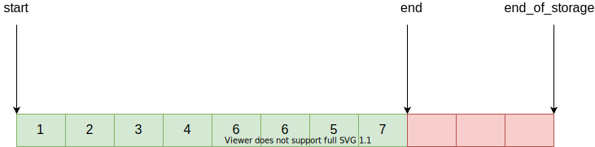
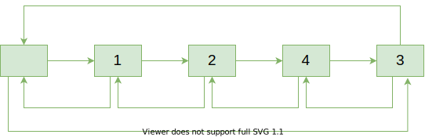
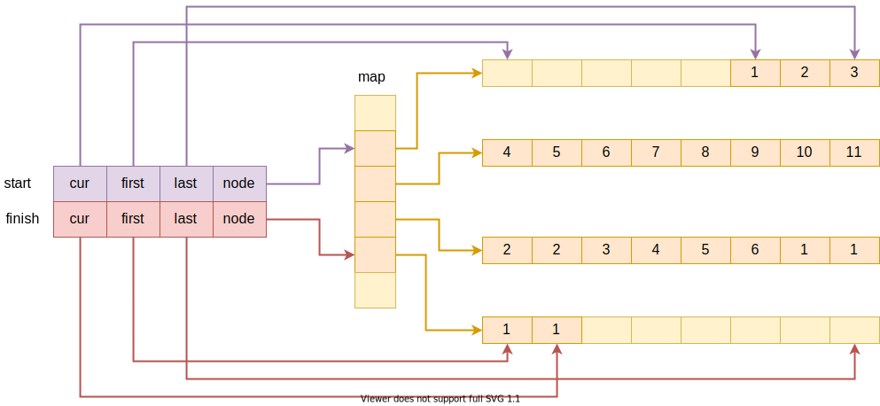

&emsp;&emsp;容器是指实例为其他类的对象的集合的类、数据结构或者抽象数据类型。换言之，它们以一种遵循特定访问规则的系统的方法来存储对象。容器的大小取决于其包含的对象（或元素）的数目。潜在的不同容器类型的实现可能在空间和时间复杂度上有所差别，这使得在给定应用场景中选择合适的某种实现具有灵活性。
&emsp;&emsp;序列式容器即容器可以有序，但是不一定有序。C++语言本身提供了一个静态数组容器```array```，STL提供了```vector,list,deque,heap,priority_queue,list,slist```几种容器，另外的```stack,queue```是基于```deque```的封装，更像一种配接器。
# 1 vector
&emsp;&emsp;```vector```是一种动态数组，其中的内存空间根据用户需要的空间大小自动分配。
## 1.1 vector基本数据结构
```cpp
template <class T, class Alloc = alloc>
class vector {
public:
  typedef T value_type;
  typedef value_type* pointer;
  typedef const value_type* const_pointer;
  typedef value_type* iterator;
  typedef const value_type* const_iterator;
  typedef value_type& reference;
  typedef const value_type& const_reference;
  typedef size_t size_type;
  typedef ptrdiff_t difference_type;

protected:
  typedef simple_alloc<value_type, Alloc> data_allocator;
  iterator start;
  iterator finish;
  iterator end_of_storage;
}
```

&emsp;&emsp;```vector```的基本数据累心如上面所述，```public```部分为基本的容器类型相关内容，另外能够看到的是```vecotor```使用的分配器是之前提到的```simple_alloc```。
&emsp;&emsp;```vector```的迭代器就是类型的普通指针，而其数据域是通过```start,finish, end_of_storage```来指示元素。其中```[start, end)```为用户实际上操作数据使用的空间，而```[start, end_of_storage)```是内部维护的实际空间大小，也就是说当用户申请一定大小的空间时，```vector```并不会完全按照用户的要求分配固定大小的空间而是将该大小向上对齐，额外分配空间保证尽可能的减少对内存分配函数的调用。



## 1.2 vector内存管理
&emsp;&emsp;```vector```通过```simple_alloc```进行内存管理，也就是说内存申请都会进行向上对齐。
&emsp;&emsp;涉及到内存扩充的有两种方式：一种是将原来的大小扩充两倍，另一种是在插入n个元素时，扩充的长度为```max(2 * old_size, n + old_size)```。另外需要注意的是针对```vector```的内存操作可能导致迭代器失效，一般不建议重用经过元素删除，扩充的```vector```的迭代器，但是从源码上能够看到的是这种迭代器的失效可能是该迭代器无法指向正确的元素。


```cpp
template <class T, class Alloc>
void vector<T, Alloc>::insert_aux(iterator position, const T& x) {                    //在position处插入元素x
  if (finish != end_of_storage) {                         //如果有额外的空间可用，则
    construct(finish, *(finish - 1));                     //在结尾构造一个末尾元素的拷贝
    ++finish;
    T x_copy = x;
    copy_backward(position, finish - 2, finish - 1);     //将[position, finish-1)的元素拷贝到[position+1,finish-2)
    *position = x_copy;
  }
  else {                                                //没有额外的空间则需要进行空间的分配
    const size_type old_size = size();
    const size_type len = old_size != 0 ? 2 * old_size : 1;   //扩充后的大小为原来尺寸的2倍
    iterator new_start = data_allocator::allocate(len);
    iterator new_finish = new_start;
    __STL_TRY {
      new_finish = uninitialized_copy(start, position, new_start);    //将原来的数据[start, position)拷贝到[new_start, new_position)
      construct(new_finish, x);
      ++new_finish;
      new_finish = uninitialized_copy(position, finish, new_finish);  //将原来的数据[position + 1, finish)拷贝到[new_position+1, new_finish)
    }

#       ifdef  __STL_USE_EXCEPTIONS 
    catch(...) {
      destroy(new_start, new_finish); 
      data_allocator::deallocate(new_start, len);
      throw;
    }
#       endif /* __STL_USE_EXCEPTIONS */
    destroy(begin(), end());                                    //销毁原来的内存
    deallocate();
    start = new_start;
    finish = new_finish;
    end_of_storage = new_start + len;
  }
}
```


```cpp
template <class T, class Alloc>
void vector<T, Alloc>::insert(iterator position, size_type n, const T& x) {                     //向position处插入n个元素并初始化为x
  if (n != 0) {
    if (size_type(end_of_storage - finish) >= n) {                  //拥有足够的可用空间插入元素
      T x_copy = x;
      const size_type elems_after = finish - position;
      iterator old_finish = finish;
      if (elems_after > n) {
        uninitialized_copy(finish - n, finish, finish);
        finish += n;
        copy_backward(position, old_finish - n, old_finish);
        fill(position, position + n, x_copy);
      }
      else {
        uninitialized_fill_n(finish, n - elems_after, x_copy);
        finish += n - elems_after;
        uninitialized_copy(position, old_finish, finish);
        finish += elems_after;
        fill(position, old_finish, x_copy);
      }
    }
    else {                                                        
      const size_type old_size = size();                            //空间不足，则需要额外申请，但是需要注意的是这里申请的内存大小是old_size+max(old_size,n)
      const size_type len = old_size + max(old_size, n);
      iterator new_start = data_allocator::allocate(len);
      iterator new_finish = new_start;
      __STL_TRY {
        new_finish = uninitialized_copy(start, position, new_start);
        new_finish = uninitialized_fill_n(new_finish, n, x);
        new_finish = uninitialized_copy(position, finish, new_finish);
      }
#         ifdef  __STL_USE_EXCEPTIONS 
      catch(...) {
        destroy(new_start, new_finish);
        data_allocator::deallocate(new_start, len);
        throw;
      }
#         endif /* __STL_USE_EXCEPTIONS */
      destroy(start, finish);
      deallocate();
      start = new_start;
      finish = new_finish;
      end_of_storage = new_start + len;
    }
  }
}
```

# 2 list
&emsp;&emsp;```list```是一个带有头结点的循环双向链表。
## 2.1 list的数据结构定义


&emsp;&emsp;下面是简单的双链表定义。
```cpp
template <class T>
struct __list_node {                                                                                                  //链表的结点定义
  typedef void* void_pointer;                         
  void_pointer next;
  void_pointer prev;
  T data;
};
```

&emsp;&emsp;下面是迭代器定义，主要是对一般的指针操作的重载：
```cpp
template<class T, class Ref, class Ptr>
struct __list_iterator {                                                                                              //链表的迭代器 
  typedef __list_iterator<T, T&, T*>             iterator;
  typedef __list_iterator<T, const T&, const T*> const_iterator;
  typedef __list_iterator<T, Ref, Ptr>           self;

  typedef bidirectional_iterator_tag iterator_category;
  typedef T value_type;
  typedef Ptr pointer;
  typedef Ref reference;
  typedef __list_node<T>* link_type;
  typedef size_t size_type;
  typedef ptrdiff_t difference_type;

  link_type node;

  __list_iterator(link_type x) : node(x) {}
  __list_iterator() {}
  __list_iterator(const iterator& x) : node(x.node) {}

  bool operator==(const self& x) const { return node == x.node; }
  bool operator!=(const self& x) const { return node != x.node; }
  reference operator*() const { return (*node).data; }

#ifndef __SGI_STL_NO_ARROW_OPERATOR
  pointer operator->() const { return &(operator*()); }
#endif /* __SGI_STL_NO_ARROW_OPERATOR */

  self& operator++() { 
    node = (link_type)((*node).next);
    return *this;
  }
  self operator++(int) { 
    self tmp = *this;
    ++*this;
    return tmp;
  }
  self& operator--() { 
    node = (link_type)((*node).prev);
    return *this;
  }
  self operator--(int) { 
    self tmp = *this;
    --*this;
    return tmp;
  }
};
```
&emsp;&emsp;完整的链表定义:
```cpp
template <class T, class Alloc = alloc>
class list {                                                                                                          //链表的定义
protected:
  typedef void* void_pointer;
  typedef __list_node<T> list_node;
  typedef simple_alloc<list_node, Alloc> list_node_allocator;
public:      
  typedef T value_type;
  typedef value_type* pointer;
  typedef const value_type* const_pointer;
  typedef value_type& reference;
  typedef const value_type& const_reference;
  typedef list_node* link_type;
  typedef size_t size_type;
  typedef ptrdiff_t difference_type;
//...省略部分代码
protected:
  link_type node;
//...省略部分代码
};
```
## 2.2 list的内存管理
&emsp;&emsp;```list```的创建销毁等工作很简单就是对一个个多个结点的内存简单释放，不需要过多复杂的操作。
```cpp
template <class T, class Alloc = alloc>
class list { 
  //...省略部分代码
protected:
  link_type get_node() { return list_node_allocator::allocate(); }                                                          //申请一个节点的内存
  void put_node(link_type p) { list_node_allocator::deallocate(p); }                                                        //销毁一个节点的内存

  link_type create_node(const T& x) {                                                                                       //创造结点并初始化为x
    link_type p = get_node();
    __STL_TRY {
      construct(&p->data, x);
    }
    __STL_UNWIND(put_node(p));
    return p;
  }
  void destroy_node(link_type p) {                                                                                          //析构结点对象并释放内存
    destroy(&p->data);
    put_node(p);
  }

protected:
  void empty_initialize() {                                                                                                 //初始化一个空链表，可以看到是循环链表
    node = get_node();
    node->next = node;
    node->prev = node;
  }

  void fill_initialize(size_type n, const T& value) {                                                                       //创建一个链表并且插入n个结点，值初始化为value
    empty_initialize();
    __STL_TRY {
      insert(begin(), n, value);
    }
    __STL_UNWIND(clear(); put_node(node));
  }

#ifdef __STL_MEMBER_TEMPLATES
  template <class InputIterator>
  void range_initialize(InputIterator first, InputIterator last) {
    empty_initialize();
    __STL_TRY {
      insert(begin(), first, last);
    }
    __STL_UNWIND(clear(); put_node(node));
  }
#else  /* __STL_MEMBER_TEMPLATES */
  void range_initialize(const T* first, const T* last) {                                                                  //创建一个链表，并插入[fist, last)的元素
    empty_initialize();
    __STL_TRY {
      insert(begin(), first, last);
    }
    __STL_UNWIND(clear(); put_node(node));
  }
  void range_initialize(const_iterator first, const_iterator last) {                                                    //创建一个链表，并插入[fist, last)的元素
    empty_initialize();
    __STL_TRY {
      insert(begin(), first, last);
    }
    __STL_UNWIND(clear(); put_node(node));
  }
  //...省略部分代码
};
```
# 3 deque
&emsp;&emsp;```deque```是一个双端队列，即能够从队列左端插入删除元素也能从队列右端插入删除元素。
## 3.1 deque的数据结构定义

&emsp;&emsp;如上图为```dequeue```的基本数据结构定义的图示，在列出其迭代器实现和具体的```dequeue```的实现之前先有个大概的印象对理解其数据结构组织方式会好很多。
&emsp;&emsp;下面是dequeue的迭代器的实现的基本数据结构。暂且不谈具体的迭代器实现方式，先看其数据结构能够看到内部维护了三个指针分别指向具体的数据内存:```cur,first,last```，等下对三者的具体含义进行解释，还拥有一个```node```指向索引结点（先了解有这个东西，具体后面解释）。
```cpp
template <class T, class Ref, class Ptr, size_t BufSiz>
struct __deque_iterator {                                                                                                     //deque的迭代器
  typedef __deque_iterator<T, T&, T*, BufSiz>             iterator;
  typedef __deque_iterator<T, const T&, const T*, BufSiz> const_iterator;
  static size_t buffer_size() {return __deque_buf_size(BufSiz, sizeof(T)); }                                                  //返回BuffSize大小所能容纳的元素个数
#else /* __STL_NON_TYPE_TMPL_PARAM_BUG */
template <class T, class Ref, class Ptr>
struct __deque_iterator {
  typedef __deque_iterator<T, T&, T*>             iterator;
  typedef __deque_iterator<T, const T&, const T*> const_iterator;
  static size_t buffer_size() {return __deque_buf_size(0, sizeof(T)); }
#endif

  typedef random_access_iterator_tag iterator_category;
  typedef T value_type;
  typedef Ptr pointer;
  typedef Ref reference;
  typedef size_t size_type;
  typedef ptrdiff_t difference_type;
  typedef T** map_pointer;

  typedef __deque_iterator self;

  T* cur;                                       //当前迭代器实际的位置
  T* first;                                     //开始位置
  T* last;                                      //结束位置
  map_pointer node;                             //指向映射表格
};
```
&emsp;&emsp;下面是```deque```的数据结构定义，能够看到的是除了其他信息，其中维护了两个迭代器，分别指向数据内存的开头和结尾，和一个```map```实际类型是一个指针数组。
&emsp;&emsp;结合上面的示意图，下面稍微解释下```deque```的内存布局。```deque```本身是双端队列，实际中的实现方式可以通过连续内存实现类似```vector```，也可以使用链表实现类似```list```，但是通过连续内存实现，在其结尾存取元素数据代价正常，但是在开头存取元素的代价可能过分巨大，因此无论什么情况都需要移动大部分元素；如果使用链表实现能够保证在开头和结尾进行数据存取操作的常数时间复杂度，但是单为```deque```维护一个链表又显得过于多余了。因此STL的```deque```的实现是通过索引进行实现的，内部维护了一个索引结点数组，每个结点对应一块缓冲区，缓冲区是真正的数据存储区域，当在开头或者插入元素时，在开头或者结尾扩充完整的缓冲区，那么在下次进行操作时就不必再次进行内存分配操作，又因为```deque```一般情况下不允许从中间插入元素，虽然实际上STL实现了这个方法，性能开销看上去也是可以接受的。
```cpp
 //deque的类定义，deque的结构和一般的不一样，它分为两部分一部分是map，另一部分是buffer，这个简单的结构可以想想为一个文件系统，map是文件系统的索引，而buffer是实际的数据内容
class deque {
public:                         // Basic types
  typedef T value_type;
  typedef value_type* pointer;
  typedef const value_type* const_pointer;
  typedef value_type& reference;
  typedef const value_type& const_reference;
  typedef size_t size_type;
  typedef ptrdiff_t difference_type;

public:                         // Iterators
#ifndef __STL_NON_TYPE_TMPL_PARAM_BUG
  typedef __deque_iterator<T, T&, T*, BufSiz>              iterator;
  typedef __deque_iterator<T, const T&, const T&, BufSiz>  const_iterator;
#else /* __STL_NON_TYPE_TMPL_PARAM_BUG */
  typedef __deque_iterator<T, T&, T*>                      iterator;
  typedef __deque_iterator<T, const T&, const T*>          const_iterator;
#endif /* __STL_NON_TYPE_TMPL_PARAM_BUG */

#ifdef __STL_CLASS_PARTIAL_SPECIALIZATION
  typedef reverse_iterator<const_iterator> const_reverse_iterator;
  typedef reverse_iterator<iterator> reverse_iterator;
#else /* __STL_CLASS_PARTIAL_SPECIALIZATION */
  typedef reverse_iterator<const_iterator, value_type, const_reference, 
                           difference_type>  
          const_reverse_iterator;
  typedef reverse_iterator<iterator, value_type, reference, difference_type>
          reverse_iterator; 
#endif /* __STL_CLASS_PARTIAL_SPECIALIZATION */

protected:                      // Internal typedefs
  typedef pointer* map_pointer;
  typedef simple_alloc<value_type, Alloc> data_allocator;                         //为了分别维护索引和数据，分别定义了两个allocator
  typedef simple_alloc<pointer, Alloc> map_allocator;

  static size_type buffer_size() {
    return __deque_buf_size(BufSiz, sizeof(value_type));
  }
  static size_type initial_map_size() { return 8; }                         //默认的map结点数目，为什么不直接定义为常量呢

protected:                      // Data members
  iterator start;                                                           //这里的start和finish和迭代器中定义的first,last不同，是整个数据结构真正的开始和结尾
  iterator finish;

  map_pointer map;
  size_type map_size;
```
&emsp;&emsp;下面是```deque```迭代器的实现方式，其中维护了四个元素，分别为:
- ```cur```：指向当前迭代器指向的元素；
- ```first```：指向当前缓冲区的开头；
- ```last```：指向当前缓冲区的结尾；
- ```node```：指向当前缓冲区对应的索引结点。

&emsp;&emsp;在进行迭代器操作的关键是，跨缓冲区操作时进行不同缓冲区之间的指针设定。主要看```self& operator+=(difference_type n) ```即可，其他实现方式类似。
```cpp
template <class T, class Ref, class Ptr, size_t BufSiz>
struct __deque_iterator {                                                                                                     //deque的迭代器
  typedef __deque_iterator<T, T&, T*, BufSiz>             iterator;
  typedef __deque_iterator<T, const T&, const T*, BufSiz> const_iterator;
  static size_t buffer_size() {return __deque_buf_size(BufSiz, sizeof(T)); }                                                  //返回BuffSize大小所能容纳的元素个数
#else /* __STL_NON_TYPE_TMPL_PARAM_BUG */
template <class T, class Ref, class Ptr>
struct __deque_iterator {
  typedef __deque_iterator<T, T&, T*>             iterator;
  typedef __deque_iterator<T, const T&, const T*> const_iterator;
  static size_t buffer_size() {return __deque_buf_size(0, sizeof(T)); }
#endif

  typedef random_access_iterator_tag iterator_category;
  typedef T value_type;
  typedef Ptr pointer;
  typedef Ref reference;
  typedef size_t size_type;
  typedef ptrdiff_t difference_type;
  typedef T** map_pointer;

  typedef __deque_iterator self;

  T* cur;                                       //当前迭代器实际的位置
  T* first;                                     //开始位置
  T* last;                                      //结束位置
  map_pointer node;                             //指向映射表格

  __deque_iterator(T* x, map_pointer y) 
    : cur(x), first(*y), last(*y + buffer_size()), node(y) {}
  __deque_iterator() : cur(0), first(0), last(0), node(0) {}
  __deque_iterator(const iterator& x)
    : cur(x.cur), first(x.first), last(x.last), node(x.node) {}

  reference operator*() const { return *cur; }
#ifndef __SGI_STL_NO_ARROW_OPERATOR
  pointer operator->() const { return &(operator*()); }
#endif /* __SGI_STL_NO_ARROW_OPERATOR */

  difference_type operator-(const self& x) const {                                                                           //两个迭代器之间的距离，实际上是两个之间完整缓冲区个数×单个缓冲区能够存储的元素个数+各自迭代器到缓冲区结尾或者开头的元素个数
    return difference_type(buffer_size()) * (node - x.node - 1) +
      (cur - first) + (x.last - x.cur);
  }

  self& operator++() {                                                                                                      //++x
    ++cur;
    if (cur == last) {                                                                //如果迭代器到达当前缓冲区的末尾则指向一下一个缓冲区
      set_node(node + 1);
      cur = first;
    }
    return *this; 
  }
  self operator++(int)  {                                                                                                   //x++
    self tmp = *this;
    ++*this;
    return tmp;
  }

  self& operator--() {                                                                                                      //--x
    if (cur == first) {                                                               //如果迭代器到达当前缓冲区的末尾则指向一上一个缓冲区
      set_node(node - 1);
      cur = last;
    }
    --cur;
    return *this;
  }
  self operator--(int) {                                                                                                    //x--
    self tmp = *this;
    --*this;
    return tmp;
  }

  self& operator+=(difference_type n) {                                                                                     //+=
    difference_type offset = n + (cur - first);
    if (offset >= 0 && offset < difference_type(buffer_size()))
      cur += n;
    else {
      difference_type node_offset =
        offset > 0 ? offset / difference_type(buffer_size())
                   : -difference_type((-offset - 1) / buffer_size()) - 1;
      set_node(node + node_offset);
      cur = first + (offset - node_offset * difference_type(buffer_size()));
    }
    return *this;
  }

  self operator+(difference_type n) const {
    self tmp = *this;
    return tmp += n;
  }

  self& operator-=(difference_type n) { return *this += -n; }
 
  self operator-(difference_type n) const {
    self tmp = *this;
    return tmp -= n;
  }

  reference operator[](difference_type n) const { return *(*this + n); }

  bool operator==(const self& x) const { return cur == x.cur; }
  bool operator!=(const self& x) const { return !(*this == x); }
  bool operator<(const self& x) const {
    return (node == x.node) ? (cur < x.cur) : (node < x.node);
  }

  void set_node(map_pointer new_node) {
    node = new_node;
    first = *new_node;
    last = first + difference_type(buffer_size());
  }
};
```

&emsp;&emsp;
&emsp;&emsp;另外在创建索引和缓冲区时，在已经分配的结点的中间选择一个节点作为进行数据操作的结点，这样无论是在结点开头还是结尾进行操作数据复杂度都是可接受的。
```cpp
template <class T, class Alloc, size_t BufSize>
void deque<T, Alloc, BufSize>::create_map_and_nodes(size_type num_elements) {
  size_type num_nodes = num_elements / buffer_size() + 1;

  map_size = max(initial_map_size(), num_nodes + 2);                          //initial_map_size返回的尺寸默认是8，也就是说至少创建8个结点
  map = map_allocator::allocate(map_size);

  map_pointer nstart = map + (map_size - num_nodes) / 2;                    //在已经分配的结点的中间选择一个节点作为进行数据操作的结点，这样无论是在结点开头还是结尾进行操作数据复杂度都是可接受的
  map_pointer nfinish = nstart + num_nodes - 1;
    
  map_pointer cur;
  __STL_TRY {
    for (cur = nstart; cur <= nfinish; ++cur)                               //针对用户申请的结点分配内存
      *cur = allocate_node();
  }
#     ifdef  __STL_USE_EXCEPTIONS 
  catch(...) {
    for (map_pointer n = nstart; n < cur; ++n)
      deallocate_node(*n);
    map_allocator::deallocate(map, map_size);
    throw;
  }
#     endif /* __STL_USE_EXCEPTIONS */

  start.set_node(nstart);
  finish.set_node(nfinish);
  start.cur = start.first;
  finish.cur = finish.first + num_elements % buffer_size();
}
```
## 3.2 deque的增删查改的实现
&emsp;&emsp;```deque```的增删查改的实现方式和大都类似只是具体代码不同，这里只谈```insert```。为了高效的进行操作，这里会先判断当前操作的位置，如果是开头则在开头进行操作，如果在结尾则在结尾进行操作，而不是直接进行对象的移动或者删除之类的操作，否则才会大规模的移动元素。
```cpp
template <class T, class Alloc, size_t BufSize>
void deque<T, Alloc, BufSize>::insert(iterator pos,
                                      size_type n, const value_type& x) {
  if (pos.cur == start.cur) {                                               //分为三种情况：如果插入位置在开头，则在开头扩充空间并插入元素；如果插入位置在结尾，则在结尾扩充空间并插入元素；否则，需要对node进行大规模的调整
    iterator new_start = reserve_elements_at_front(n);
    uninitialized_fill(new_start, start, x);
    start = new_start;
  }
  else if (pos.cur == finish.cur) {
    iterator new_finish = reserve_elements_at_back(n);
    uninitialized_fill(finish, new_finish, x);
    finish = new_finish;
  }
  else 
    insert_aux(pos, n, x);
}
```
&emsp;&emsp;在进行大规模的对象移动或者删除时会判断当前位置的相对位置，如果当前位置离开头元素少，则操作[start, position)，否则操作[position + 1, end)。
```cpp
template <class T, class Alloc, size_t BufSize>
typename deque<T, Alloc, BufSize>::iterator
deque<T, Alloc, BufSize>::insert_aux(iterator pos, const value_type& x) {
  difference_type index = pos - start;
  value_type x_copy = x;
  if (index < size() / 2) {
    push_front(front());
    iterator front1 = start;
    ++front1;
    iterator front2 = front1;
    ++front2;
    pos = start + index;
    iterator pos1 = pos;
    ++pos1;
    copy(front2, pos1, front1);
  }
  else {
    push_back(back());
    iterator back1 = finish;
    --back1;
    iterator back2 = back1;
    --back2;
    pos = start + index;
    copy_backward(pos, back2, back1);
  }
  *pos = x_copy;
  return pos;
}
```
# 4 stack
&emsp;&emsp;stack内部包含一个序列容器，基本结构是对使用的序列容器的一个简单封装，默认是采用deque，当然也可以指定其他的容器,如```list```。另外，stack没有迭代器是因为该结构不允许随机访问元素，元素操作必须符合FILO。
```cpp
/*
 * stack内部包含一个序列容器，基本结构是对使用的序列容器的一个简单封装，默认是采用deque，当然也可以指定其他的容器
 */
#ifndef __STL_LIMITED_DEFAULT_TEMPLATES
template <class T, class Sequence = deque<T> >
#else
template <class T, class Sequence>
#endif
class stack {
  friend bool operator== __STL_NULL_TMPL_ARGS (const stack&, const stack&);
  friend bool operator< __STL_NULL_TMPL_ARGS (const stack&, const stack&);
public:
  typedef typename Sequence::value_type value_type;
  typedef typename Sequence::size_type size_type;
  typedef typename Sequence::reference reference;
  typedef typename Sequence::const_reference const_reference;
protected:
  Sequence c;
public:
  bool empty() const { return c.empty(); }
  size_type size() const { return c.size(); }
  reference top() { return c.back(); }
  const_reference top() const { return c.back(); }
  void push(const value_type& x) { c.push_back(x); }
  void pop() { c.pop_back(); }
};

template <class T, class Sequence>
bool operator==(const stack<T, Sequence>& x, const stack<T, Sequence>& y) {
  return x.c == y.c;
}

template <class T, class Sequence>
bool operator<(const stack<T, Sequence>& x, const stack<T, Sequence>& y) {
  return x.c < y.c;
}

__STL_END_NAMESPACE
```

# 5 queue
&emsp;&emsp;```queue```内部包含一个序列容器，基本结构是对使用的序列容器的一个简单封装，默认是采用deque，当然也可以指定其他的容器,如```list```。另外，```queue```没有迭代器是因为该结构不允许随机访问元素，元素操作必须符合FIFO。
```cpp
/*
 * queue内部包含一个序列容器，基本结构是对使用的序列容器的一个简单封装，默认是采用deque，当然也可以指定其他的容器比如list
 */
#ifndef __STL_LIMITED_DEFAULT_TEMPLATES
template <class T, class Sequence = deque<T> >
#else
template <class T, class Sequence>
#endif
class queue {
  friend bool operator== __STL_NULL_TMPL_ARGS (const queue& x, const queue& y);
  friend bool operator< __STL_NULL_TMPL_ARGS (const queue& x, const queue& y);
public:
  typedef typename Sequence::value_type value_type;
  typedef typename Sequence::size_type size_type;
  typedef typename Sequence::reference reference;
  typedef typename Sequence::const_reference const_reference;
protected:
  Sequence c;
public:
  bool empty() const { return c.empty(); }
  size_type size() const { return c.size(); }
  reference front() { return c.front(); }
  const_reference front() const { return c.front(); }
  reference back() { return c.back(); }
  const_reference back() const { return c.back(); }
  void push(const value_type& x) { c.push_back(x); }
  void pop() { c.pop_front(); }
};

template <class T, class Sequence>
bool operator==(const queue<T, Sequence>& x, const queue<T, Sequence>& y) {
  return x.c == y.c;
}

template <class T, class Sequence>
bool operator<(const queue<T, Sequence>& x, const queue<T, Sequence>& y) {
  return x.c < y.c;
}
```
# 6 heap
&emsp;&emsp;这里的堆准确的说并不是一个数据结构而是一系列在已有容器上构建最大堆的API。具体实现没什么可说的，就是一般的堆实现算法。
```cpp
template <class RandomAccessIterator, class T, class Distance>
void __make_heap(RandomAccessIterator first, RandomAccessIterator last, T*,                 //在现有容器上构建堆
                 Distance*) {
  if (last - first < 2) return;
  Distance len = last - first;
  Distance parent = (len - 2)/2;
    
  while (true) {
    __adjust_heap(first, parent, len, T(*(first + parent)));
    if (parent == 0) return;
    parent--;
  }
}
```

```cpp
template <class RandomAccessIterator, class Distance, class T, class Compare>
void __adjust_heap(RandomAccessIterator first, Distance holeIndex,          //调整堆，从顶向下调整，可提供过com比较方式的实现版本
                   Distance len, T value, Compare comp) {
  Distance topIndex = holeIndex;
  Distance secondChild = 2 * holeIndex + 2;
  while (secondChild < len) {
    if (comp(*(first + secondChild), *(first + (secondChild - 1))))
      secondChild--;
    *(first + holeIndex) = *(first + secondChild);
    holeIndex = secondChild;
    secondChild = 2 * (secondChild + 1);
  }
  if (secondChild == len) {
    *(first + holeIndex) = *(first + (secondChild - 1));
    holeIndex = secondChild - 1;
  }
  __push_heap(first, holeIndex, topIndex, value, comp);
}
```

```cpp
template <class RandomAccessIterator, class Distance, class T, class Compare>
void __push_heap(RandomAccessIterator first, Distance holeIndex,
                 Distance topIndex, T value, Compare comp) {                        //将元素插入到堆中，将元素和父元素比较不断下沉，针对不可比较元素的实现版本
  Distance parent = (holeIndex - 1) / 2;
  while (holeIndex > topIndex && comp(*(first + parent), value)) {
    *(first + holeIndex) = *(first + parent);
    holeIndex = parent;
    parent = (holeIndex - 1) / 2;
  }
  *(first + holeIndex) = value;
}
```

```cpp
template <class RandomAccessIterator, class T, class Distance>
inline void __pop_heap(RandomAccessIterator first, RandomAccessIterator last,
                       RandomAccessIterator result, T value, Distance*) {
  *result = *first;
  __adjust_heap(first, Distance(0), Distance(last - first), value);
}
```
# 7 priority_queue
&emsp;&emsp;```priority_queue```是一个大根堆，是对序列容器的包装，然后通过```heap```相关的算法将序列容器组织成一个```heap```。因为有严格的数据操作要求因此没有迭代器。
```cpp
#ifndef __STL_LIMITED_DEFAULT_TEMPLATES
template <class T, class Sequence = vector<T>, 
          class Compare = less<typename Sequence::value_type> >
#else
template <class T, class Sequence, class Compare>
#endif
class  priority_queue {
public:
  typedef typename Sequence::value_type value_type;
  typedef typename Sequence::size_type size_type;
  typedef typename Sequence::reference reference;
  typedef typename Sequence::const_reference const_reference;
protected:
  Sequence c;
  Compare comp;
public:
  priority_queue() : c() {}
  explicit priority_queue(const Compare& x) :  c(), comp(x) {}

#ifdef __STL_MEMBER_TEMPLATES
  template <class InputIterator>
  priority_queue(InputIterator first, InputIterator last, const Compare& x)
    : c(first, last), comp(x) { make_heap(c.begin(), c.end(), comp); }
  template <class InputIterator>
  priority_queue(InputIterator first, InputIterator last) 
    : c(first, last) { make_heap(c.begin(), c.end(), comp); }
#else /* __STL_MEMBER_TEMPLATES */
  priority_queue(const value_type* first, const value_type* last, 
                 const Compare& x) : c(first, last), comp(x) {
    make_heap(c.begin(), c.end(), comp);
  }
  priority_queue(const value_type* first, const value_type* last) 
    : c(first, last) { make_heap(c.begin(), c.end(), comp); }
#endif /* __STL_MEMBER_TEMPLATES */

  bool empty() const { return c.empty(); }
  size_type size() const { return c.size(); }
  const_reference top() const { return c.front(); }
  void push(const value_type& x) {
    __STL_TRY {
      c.push_back(x); 
      push_heap(c.begin(), c.end(), comp);
    }
    __STL_UNWIND(c.clear());
  }
  void pop() {
    __STL_TRY {
      pop_heap(c.begin(), c.end(), comp);
      c.pop_back();
    }
    __STL_UNWIND(c.clear());
  }
};
```

# 8 slist
&emsp;&emsp;```slist```是一个有头结点的单链表。其实现很简单主要关注先其数据结构即可。但是需要注意的是，```slist```提供的```insert```方法是```O(n)```。
```cpp
struct __slist_node_base
{
  __slist_node_base* next;
};

inline __slist_node_base* __slist_make_link(__slist_node_base* prev_node,       //将new_node插入到prev_node之后
                                            __slist_node_base* new_node)
{
  new_node->next = prev_node->next;
  prev_node->next = new_node;
  return new_node;
}

inline __slist_node_base* __slist_previous(__slist_node_base* head,           //找到node的上一个结点
                                           const __slist_node_base* node)
{
  while (head && head->next != node)
    head = head->next;
  return head;
}

inline const __slist_node_base* __slist_previous(const __slist_node_base* head,
                                                 const __slist_node_base* node)
{
  while (head && head->next != node)
    head = head->next;
  return head;
}

inline void __slist_splice_after(__slist_node_base* pos,            //交换pos和[before_first, before_last)
                                 __slist_node_base* before_first,
                                 __slist_node_base* before_last)
{
  if (pos != before_first && pos != before_last) {
    __slist_node_base* first = before_first->next;
    __slist_node_base* after = pos->next;
    before_first->next = before_last->next;
    pos->next = first;
    before_last->next = after;
  }
}

inline __slist_node_base* __slist_reverse(__slist_node_base* node)    //反转链表
{
  __slist_node_base* result = node;
  node = node->next;
  result->next = 0;
  while(node) {
    __slist_node_base* next = node->next;
    node->next = result;
    result = node;
    node = next;
  }
  return result;
}

template <class T>
struct __slist_node : public __slist_node_base          //链表节点的定义
{
  T data;
};

struct __slist_iterator_base
{
  typedef size_t size_type;
  typedef ptrdiff_t difference_type;
  typedef forward_iterator_tag iterator_category;

  __slist_node_base* node;

  __slist_iterator_base(__slist_node_base* x) : node(x) {}
  void incr() { node = node->next; }

  bool operator==(const __slist_iterator_base& x) const {
    return node == x.node;
  }
  bool operator!=(const __slist_iterator_base& x) const {
    return node != x.node;
  }
};

template <class T, class Ref, class Ptr>
struct __slist_iterator : public __slist_iterator_base          //迭代器是一个前线迭代器
{
  typedef __slist_iterator<T, T&, T*>             iterator;
  typedef __slist_iterator<T, const T&, const T*> const_iterator;
  typedef __slist_iterator<T, Ref, Ptr>           self;

  typedef T value_type;
  typedef Ptr pointer;
  typedef Ref reference;
  typedef __slist_node<T> list_node;

  __slist_iterator(list_node* x) : __slist_iterator_base(x) {}
  __slist_iterator() : __slist_iterator_base(0) {}
  __slist_iterator(const iterator& x) : __slist_iterator_base(x.node) {}

  reference operator*() const { return ((list_node*) node)->data; }
#ifndef __SGI_STL_NO_ARROW_OPERATOR
  pointer operator->() const { return &(operator*()); }
#endif /* __SGI_STL_NO_ARROW_OPERATOR */

  self& operator++()
  {
    incr();
    return *this;
  }
  self operator++(int)
  {
    self tmp = *this;
    incr();
    return tmp;
  }
};

#ifndef __STL_CLASS_PARTIAL_SPECIALIZATION

inline ptrdiff_t*
distance_type(const __slist_iterator_base&)
{
  return 0;
}

inline forward_iterator_tag
iterator_category(const __slist_iterator_base&)
{
  return forward_iterator_tag();
}

template <class T, class Ref, class Ptr> 
inline T* 
value_type(const __slist_iterator<T, Ref, Ptr>&) {
  return 0;
}

#endif /* __STL_CLASS_PARTIAL_SPECIALIZATION */

inline size_t __slist_size(__slist_node_base* node)
{
  size_t result = 0;
  for ( ; node != 0; node = node->next)
    ++result;
  return result;
}

template <class T, class Alloc = alloc>
class slist                                                                     //slist的完整定义
{
public:
  typedef T value_type;
  typedef value_type* pointer;
  typedef const value_type* const_pointer;
  typedef value_type& reference;
  typedef const value_type& const_reference;
  typedef size_t size_type;
  typedef ptrdiff_t difference_type;

  typedef __slist_iterator<T, T&, T*>             iterator;
  typedef __slist_iterator<T, const T&, const T*> const_iterator;

private:
  typedef __slist_node<T> list_node;
  typedef __slist_node_base list_node_base;
  typedef __slist_iterator_base iterator_base;
  typedef simple_alloc<list_node, Alloc> list_node_allocator;
};
```