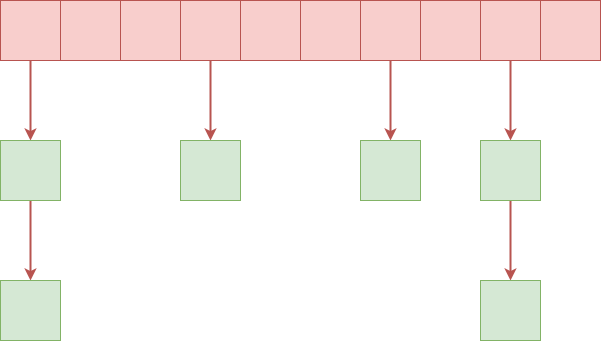

# 1 关联容器简介
&emsp;&emsp;关联容器即数据在存储还是访问上没有明确的前后关系，虽然实际操作时可以通过```++```之类的操作符移动迭代器访问下一个元素，但是这只是特定容器内定的顺序而已，实际上只存在最大值和最小值。标准STl的关联容器有:```set,map,multiset,multimap```等，SGI-STL额外实现了基于```hash_table```的```has_set,hash_map,hash_multiset,hash_multimap```。
&emsp;&emsp;STL中关联容器主要通过RBTree实现。
- 关联容器是红黑树实现，无序关联容器是哈希表实现。
- 关联容器保证按键值有序遍历，因此可以做范围查找，而无序关联容器不可以。关联支持一些导航类的操作，如求出给定键最邻近的键，最大键、最小键操作。
- 关联容器的迭代器不会失效，除非所指元素被删除。无序关联容器的iterator在修改元素时可能会失效。所以对关联容器的遍历与修改在一定程度上可并行。


# 2 红黑树
&emsp;&emsp;红黑树是STL中实现大多数容器的基本数据结构。红黑树（英语：Red–black tree）是一种自平衡二叉查找树，它的结构复杂，但它的操作有着良好的最坏情况运行时间，并且在实践中高效：它可以在时间$O(nlog_n)$内完成查找、插入和删除。红黑树是每个节点都带有颜色属性的二叉查找树，颜色为红色或黑色。在二叉查找树强制一般要求以外，对于任何有效的红黑树增加了如下的额外要求：
1. 节点要么是红色要么是黑色；
2. 根节点是黑色；
3. 所有叶子节点是黑色；
4. 每个红色节点必须有两个黑色的子节点；
5. 从任一节点到其每个叶子的所有简单路径都包含相同数目的黑色节点。

> 这里不会特别纠结红黑树的实现方式，和具体的原理，只会稍微提一下
## 2.1 红黑树数据结构
&emsp;&emsp;红黑树最基本的节点数据如下图所示，每个节点保存了三个指针分别指向父节点，右子节点，左子节点，是一个典型的二叉树结构。
```cpp
struct __rb_tree_node_base
{
  typedef __rb_tree_color_type color_type;
  typedef __rb_tree_node_base* base_ptr;

  color_type color; 
  base_ptr parent;
  base_ptr left;
  base_ptr right;

  static base_ptr minimum(base_ptr x)                                                                     //给定子树的最小值，最左子节点
  {
    while (x->left != 0) x = x->left;
    return x;
  }

  static base_ptr maximum(base_ptr x)                                                                     //给定子树的最大值，最右子节点
  {
    while (x->right != 0) x = x->right;
    return x;
  }
};

template <class Value>
struct __rb_tree_node : public __rb_tree_node_base
{
  typedef __rb_tree_node<Value>* link_type;
  Value value_field;
};
```
&emsp;&emsp;如下为最基本的红黑树的实现，该结构保存了一个header，用来指向红黑树的开头，结尾和根节点。
```cpp
template <class Key, class Value, class KeyOfValue, class Compare,
          class Alloc = alloc>
class rb_tree {
protected:
  typedef void* void_pointer;
  typedef __rb_tree_node_base* base_ptr;
  typedef __rb_tree_node<Value> rb_tree_node;
  typedef simple_alloc<rb_tree_node, Alloc> rb_tree_node_allocator;
  typedef __rb_tree_color_type color_type;
public:
  typedef Key key_type;
  typedef Value value_type;
  typedef value_type* pointer;
  typedef const value_type* const_pointer;
  typedef value_type& reference;
  typedef const value_type& const_reference;
  typedef rb_tree_node* link_type;
  typedef size_t size_type;
  typedef ptrdiff_t difference_type;
protected:
  size_type node_count; // keeps track of size of tree
  link_type header;                                                                           //header类似于一个链表的头节点，parent指向树的根节点，left指向最左子节点，right指向最右子节点
  Compare key_compare;
```


&emsp;&emsp;红黑树的迭代器相比较比较简单，主要是如何快速的找到前驱和后继节点。因为树中存在一个头节点可以指向开头结尾和根节点，因此相关实现也会简单些。
```cpp
struct __rb_tree_base_iterator                                                                              //红黑树迭代器定义
{
  typedef __rb_tree_node_base::base_ptr base_ptr;
  typedef bidirectional_iterator_tag iterator_category;
  typedef ptrdiff_t difference_type;
  base_ptr node;

  void increment()                                                                                          //迭代器指向的下一个节点是树的中序遍历的下一个节点
  {
    if (node->right != 0) {                       //寻找右子树的最左子节点
      node = node->right;
      while (node->left != 0)
        node = node->left;
    }
    else {                                        //当右子树为空时，分为两种情况，若当前节点为父节点的左子节点，则后驱结点应当是父节点，否则为第一个不为右子节点的祖先节点
      base_ptr y = node->parent;
      while (node == y->right) {
        node = y;
        y = y->parent;
      }
      if (node->right != y)
        node = y;
    }
  }

  void decrement()                                                                                          //前驱节点应当是中序遍历的前一个节点
  {
    if (node->color == __rb_tree_red &&               //针对end()的特殊处理，
        node->parent->parent == node)
      node = node->right;
    else if (node->left != 0) {                 //寻找左子树的最右子节点
      base_ptr y = node->left;
      while (y->right != 0)
        y = y->right;
      node = y;
    }
    else {                                    //当左子树为空，当当前节点为父节点的左子树时找到第一个使当前节点不为左子节点的祖先节点，便是前驱
      base_ptr y = node->parent;
      while (node == y->left) {
        node = y;
        y = y->parent;
      }
      node = y;
    }
  }
};
```

## 2.2 红黑树的插入和删除
&emsp;&emsp;红黑树的插入和删除可能会破坏树本身的结构，因此需要进行旋转，左旋转和右旋转的代码比较简单这里不会列出来。主要是插入比较复杂，一般分为几种情况（插入的节点默认是红色）：
1. 插入节点位置的父节点和父节点的兄弟节点均为红色，则需要进行颜色的反转；
2. 插入位置为左子树内插，则需要先左旋转后右旋转；
3. 插入位置为左子树的外插，则需要右旋转；
4. 插入位置为右子树的内插，则需要先右旋转后左旋转；
5. 插入位置为右子树的外插，则需要左旋转。

```cpp
inline void 
__rb_tree_rebalance(__rb_tree_node_base* x, __rb_tree_node_base*& root)                                                             //插入完节点之后进行rbtree的重平衡操作，保证符合rbtree的条件x为插入的节点
{
  x->color = __rb_tree_red;                         //插入节点首先设置为红色
  while (x != root && x->parent->color == __rb_tree_red) {                              //如果一直存在双红的情况则一直进行调整
    if (x->parent == x->parent->parent->left) {                              //如果当前节点的父结点为祖先节点的左子节点
      __rb_tree_node_base* y = x->parent->parent->right;
      if (y && y->color == __rb_tree_red) {                   //如果父节点及父节点的兄弟节点同为红色，则反转颜色
        x->parent->color = __rb_tree_black;
        y->color = __rb_tree_black;
        x->parent->parent->color = __rb_tree_red;
        x = x->parent->parent;                  //不断向上回溯，直到节点符合红黑树的条件
      }
      else {
        if (x == x->parent->right) {                          //当前节点为父节点的右子节点，即左子树内插，则需要先左旋转后右旋转
          x = x->parent;
          __rb_tree_rotate_left(x, root);
        }
        x->parent->color = __rb_tree_black;
        x->parent->parent->color = __rb_tree_red;
        __rb_tree_rotate_right(x->parent->parent, root);
      }
    }
    else {                                                                  //如果当前节点的父结点为祖先节点的右子节点
      __rb_tree_node_base* y = x->parent->parent->left;
      if (y && y->color == __rb_tree_red) {                   //如果父节点及父节点的兄弟节点同为红色，则反转颜色
        x->parent->color = __rb_tree_black;
        y->color = __rb_tree_black;
        x->parent->parent->color = __rb_tree_red;
        x = x->parent->parent;
      }
      else {
        if (x == x->parent->left) {                         //当前节点为父节点的右子节点，即右子树内插，则需要先右旋转后左旋转
          x = x->parent;
          __rb_tree_rotate_right(x, root);
        }
        x->parent->color = __rb_tree_black;
        x->parent->parent->color = __rb_tree_red;
        __rb_tree_rotate_left(x->parent->parent, root);
      }
    }
  }
  root->color = __rb_tree_black;
}
```
&emsp;&emsp;红黑树的删除问题比较复杂，这里不做讨论，毕竟不是专门讲红黑树的内容。稍微提一下，删除红黑树的节点，因为删除后要寻找前驱或者后继节点，完全可以将对应的元素进行交换转换成删除叶子节点，这样会方便很多。

# 3 set
## 3.1 set
&emsp;&emsp;```set```是一个有序集合，不允许两个相同的键值。```set```不允许修改元素，也就是说其迭代器被声明为```const iterator```，并且对树的删除和插入操作并不会影响迭代器，除了删除节点的迭代器。底层实现为红黑树。```set```基本是对红黑树的封装。
```cpp
#ifndef __STL_LIMITED_DEFAULT_TEMPLATES
template <class Key, class Compare = less<Key>, class Alloc = alloc>
#else
template <class Key, class Compare, class Alloc = alloc>
#endif
class set {
public:
  // typedefs:

  typedef Key key_type;
  typedef Key value_type;
  typedef Compare key_compare;
  typedef Compare value_compare;
private:
  typedef rb_tree<key_type, value_type, 
                  identity<value_type>, key_compare, Alloc> rep_type;
  rep_type t;  // red-black tree representing set
public:
  typedef typename rep_type::const_pointer pointer;
  typedef typename rep_type::const_pointer const_pointer;
  typedef typename rep_type::const_reference reference;
  typedef typename rep_type::const_reference const_reference;
  typedef typename rep_type::const_iterator iterator;
  typedef typename rep_type::const_iterator const_iterator;
  typedef typename rep_type::const_reverse_iterator reverse_iterator;
  typedef typename rep_type::const_reverse_iterator const_reverse_iterator;
  typedef typename rep_type::size_type size_type;
  typedef typename rep_type::difference_type difference_type;
};
```
## 3.2 multiset
&emsp;&emsp;```multiset```和```set```基本相同，只不过前者允许重复键值。```multiset```的实现和```set```基本相同只不过元素插入采用```insert_equal```，即允许相等键值的存在。
```cpp
multiset(const_iterator first, const_iterator last)
    : t(Compare()) { t.insert_equal(first, last); }
```
# 4 map
## 4.1 pair
```
template <class T1, class T2>
struct pair {
  typedef T1 first_type;
  typedef T2 second_type;

  T1 first;
  T2 second;
  pair() : first(T1()), second(T2()) {}
  pair(const T1& a, const T2& b) : first(a), second(b) {}

#ifdef __STL_MEMBER_TEMPLATES
  template <class U1, class U2>
  pair(const pair<U1, U2>& p) : first(p.first), second(p.second) {}
#endif
};

template <class T1, class T2>
inline bool operator==(const pair<T1, T2>& x, const pair<T1, T2>& y) { 
  return x.first == y.first && x.second == y.second; 
}

template <class T1, class T2>
inline bool operator<(const pair<T1, T2>& x, const pair<T1, T2>& y) { 
  return x.first < y.first || (!(y.first < x.first) && x.second < y.second); 
}

template <class T1, class T2>
inline pair<T1, T2> make_pair(const T1& x, const T2& y) {
  return pair<T1, T2>(x, y);
}
```
## 4.2 map
&emsp;&emsp;```map```是一个有序键值对集合，不允许两个相同的键值。```map```的键值不可修改，但是值可以修改。底层实现为红黑树。map也是对rbtree的封装，需要注意的是```value_type```。
```cpp
template <class Key, class T, class Compare = less<Key>, class Alloc = alloc>
#else
template <class Key, class T, class Compare, class Alloc = alloc>
#endif
class map {
public:

// typedefs:

  typedef Key key_type;
  typedef T data_type;
  typedef T mapped_type;
  typedef pair<const Key, T> value_type;
  typedef Compare key_compare;
    
  class value_compare
    : public binary_function<value_type, value_type, bool> {
  friend class map<Key, T, Compare, Alloc>;
  protected :
    Compare comp;
    value_compare(Compare c) : comp(c) {}
  public:
    bool operator()(const value_type& x, const value_type& y) const {
      return comp(x.first, y.first);
    }
  };

private:
  typedef rb_tree<key_type, value_type, 
                  select1st<value_type>, key_compare, Alloc> rep_type;
  rep_type t;  // red-black tree representing map
public:
  typedef typename rep_type::pointer pointer;
  typedef typename rep_type::const_pointer const_pointer;
  typedef typename rep_type::reference reference;
  typedef typename rep_type::const_reference const_reference;
  typedef typename rep_type::iterator iterator;
  typedef typename rep_type::const_iterator const_iterator;
  typedef typename rep_type::reverse_iterator reverse_iterator;
  typedef typename rep_type::const_reverse_iterator const_reverse_iterator;
  typedef typename rep_type::size_type size_type;
  typedef typename rep_type::difference_type difference_type;
};
```
## 4.3 multimap
&emsp;&emsp;```multimap```和```map```基本相同，只不过前者允许重复键值。基本相同只不过元素插入采用```insert_equal```，即允许相等键值的存在。
```cpp
  multimap(const value_type* first, const value_type* last,
           const Compare& comp)
    : t(comp) { t.insert_equal(first, last); }
```
# 5 hashtable
&emsp;&emsp;哈希表相比于红黑树等结构利用空间换时间，一般拥有常数的查找复杂度，但是插入比较麻烦。哈希表的插入可能产生冲突，一般解决冲突的方式是通过开链，线性探测，二次探测等，或者保证存储元素的数组是素数等尽量减少冲突。哈希表中存储的元素除以表的长度是负载系数，一般哈希表的负载系数都会维护在一定区间，太高就会对表进行扩张，太小可能对表进行紧缩。SGI采用的是开链避免冲突。

## 5.1 哈希表数据结构
```cpp
template <class Value>
struct __hashtable_node
{
  __hashtable_node* next;
  Value val;
};  
```
&emsp;&emsp;哈希表的迭代器如下，该迭代器是一个前向迭代器。
```cpp
template <class Value, class Key, class HashFcn,
          class ExtractKey, class EqualKey, class Alloc>
struct __hashtable_iterator {
  typedef hashtable<Value, Key, HashFcn, ExtractKey, EqualKey, Alloc>
          hashtable;
  typedef __hashtable_iterator<Value, Key, HashFcn, 
                               ExtractKey, EqualKey, Alloc>
          iterator;
  typedef __hashtable_const_iterator<Value, Key, HashFcn, 
                                     ExtractKey, EqualKey, Alloc>
          const_iterator;
  typedef __hashtable_node<Value> node;

  typedef forward_iterator_tag iterator_category;
  typedef Value value_type;
  typedef ptrdiff_t difference_type;
  typedef size_t size_type;
  typedef Value& reference;
  typedef Value* pointer;

  node* cur;
  hashtable* ht;

  __hashtable_iterator(node* n, hashtable* tab) : cur(n), ht(tab) {}
  __hashtable_iterator() {}
  reference operator*() const { return cur->val; }
#ifndef __SGI_STL_NO_ARROW_OPERATOR
  pointer operator->() const { return &(operator*()); }
#endif /* __SGI_STL_NO_ARROW_OPERATOR */
  iterator& operator++();
  iterator operator++(int);
  bool operator==(const iterator& it) const { return cur == it.cur; }
  bool operator!=(const iterator& it) const { return cur != it.cur; }
};
```
&emsp;&emsp;可以看到的是哈希表是基于```vector```实现的，该```vector```中存储了多个单链表的头节点。
```
template <class Value, class Key, class HashFcn,
          class ExtractKey, class EqualKey,
          class Alloc>
class hashtable {
public:
  typedef Key key_type;
  typedef Value value_type;
  typedef HashFcn hasher;
  typedef EqualKey key_equal;

  typedef size_t            size_type;
  typedef ptrdiff_t         difference_type;
  typedef value_type*       pointer;
  typedef const value_type* const_pointer;
  typedef value_type&       reference;
  typedef const value_type& const_reference;

  hasher hash_funct() const { return hash; }
  key_equal key_eq() const { return equals; }

private:
  hasher hash;
  key_equal equals;
  ExtractKey get_key;

  typedef __hashtable_node<Value> node;
  typedef simple_alloc<node, Alloc> node_allocator;

  vector<node*,Alloc> buckets;
  size_type num_elements;
};
```

&emsp;&emsp;另外，STL中使用表格存储先已知的素数集合来进行扫描，因为求解素数本身就是很难求解的，使用表格反而效率高。
```cpp
// Note: assumes long is at least 32 bits.
static const int __stl_num_primes = 28;
static const unsigned long __stl_prime_list[__stl_num_primes] =
{
  53,         97,           193,         389,       769,
  1543,       3079,         6151,        12289,     24593,
  49157,      98317,        196613,      393241,    786433,
  1572869,    3145739,      6291469,     12582917,  25165843,
  50331653,   100663319,    201326611,   402653189, 805306457, 
  1610612741, 3221225473ul, 4294967291ul
};

inline unsigned long __stl_next_prime(unsigned long n)
{
  const unsigned long* first = __stl_prime_list;
  const unsigned long* last = __stl_prime_list + __stl_num_primes;
  const unsigned long* pos = lower_bound(first, last, n);
  return pos == last ? *(last - 1) : *pos;
}
```

&emsp;&emsp;用户可能需要自己提供hash函数，虽然有默认的哈希函数，但是都很简单。
```cpp
inline size_t __stl_hash_string(const char* s)
{
  unsigned long h = 0; 
  for ( ; *s; ++s)
    h = 5*h + *s;
  
  return size_t(h);
}

__STL_TEMPLATE_NULL struct hash<char*>
{
  size_t operator()(const char* s) const { return __stl_hash_string(s); }
};

__STL_TEMPLATE_NULL struct hash<const char*>
{
  size_t operator()(const char* s) const { return __stl_hash_string(s); }
};

__STL_TEMPLATE_NULL struct hash<char> {
  size_t operator()(char x) const { return x; }
};
__STL_TEMPLATE_NULL struct hash<unsigned char> {
  size_t operator()(unsigned char x) const { return x; }
};
__STL_TEMPLATE_NULL struct hash<signed char> {
  size_t operator()(unsigned char x) const { return x; }
};
__STL_TEMPLATE_NULL struct hash<short> {
  size_t operator()(short x) const { return x; }
};
__STL_TEMPLATE_NULL struct hash<unsigned short> {
  size_t operator()(unsigned short x) const { return x; }
};
__STL_TEMPLATE_NULL struct hash<int> {
  size_t operator()(int x) const { return x; }
};
__STL_TEMPLATE_NULL struct hash<unsigned int> {
  size_t operator()(unsigned int x) const { return x; }
};
__STL_TEMPLATE_NULL struct hash<long> {
  size_t operator()(long x) const { return x; }
};
__STL_TEMPLATE_NULL struct hash<unsigned long> {
  size_t operator()(unsigned long x) const { return x; }
};
```
## 5.2 哈希表的构造和内存管理
&emsp;&emsp;通过```allocator```构造和销毁节点。
```cpp
node* new_node(const value_type& obj)
  {
    node* n = node_allocator::allocate();
    n->next = 0;
    __STL_TRY {
      construct(&n->val, obj);
      return n;
    }
    __STL_UNWIND(node_allocator::deallocate(n));
  }
  
  void delete_node(node* n)
  {
    destroy(&n->val);
    node_allocator::deallocate(n);
  }
```
&emsp;&emsp;构造大量，桶时调用下面的初始化函数。
```cpp
void initialize_buckets(size_type n)                  //哈希表节点格式保证是素数的，能够减少冲突
  {
    const size_type n_buckets = next_size(n);
    buckets.reserve(n_buckets);
    buckets.insert(buckets.end(), n_buckets, (node*) 0);
    num_elements = 0;
  }
```
&emsp;&emsp;在进行插入操作时，需要判断桶是否需要进行扩充，然后再进行插入。有点儿匪夷所思的是判断是否进行扩充的原则是如果元素个数是否大于桶节点的个数，大于则扩充，否则放弃。
```cpp
template <class V, class K, class HF, class Ex, class Eq, class A>
void hashtable<V, K, HF, Ex, Eq, A>::resize(size_type num_elements_hint)
{
  const size_type old_n = buckets.size();
  if (num_elements_hint > old_n) {                      //判断是否进行扩充的原则是如果元素个数大于桶节点的个数
    const size_type n = next_size(num_elements_hint);
    if (n > old_n) {
      vector<node*, A> tmp(n, (node*) 0);
      __STL_TRY {
        for (size_type bucket = 0; bucket < old_n; ++bucket) {    //拷贝数据
          node* first = buckets[bucket];
          while (first) {
            size_type new_bucket = bkt_num(first->val, n);
            buckets[bucket] = first->next;
            first->next = tmp[new_bucket];
            tmp[new_bucket] = first;
            first = buckets[bucket];          
          }
        }
        buckets.swap(tmp);
      }
#         ifdef __STL_USE_EXCEPTIONS
      catch(...) {
        for (size_type bucket = 0; bucket < tmp.size(); ++bucket) {
          while (tmp[bucket]) {
            node* next = tmp[bucket]->next;
            delete_node(tmp[bucket]);
            tmp[bucket] = next;
          }
        }
        throw;
      }
#         endif /* __STL_USE_EXCEPTIONS */
    }
  }
}
```

```cpp
/*
 * @brief 非重复的插入，简单的遍历对应桶的节点，如果不存在则插入，存在则不插入
 */
template <class V, class K, class HF, class Ex, class Eq, class A>
pair<typename hashtable<V, K, HF, Ex, Eq, A>::iterator, bool> 
hashtable<V, K, HF, Ex, Eq, A>::insert_unique_noresize(const value_type& obj)
{
  const size_type n = bkt_num(obj);
  node* first = buckets[n];

  for (node* cur = first; cur; cur = cur->next) 
    if (equals(get_key(cur->val), get_key(obj)))
      return pair<iterator, bool>(iterator(cur, this), false);

  node* tmp = new_node(obj);
  tmp->next = first;
  buckets[n] = tmp;
  ++num_elements;
  return pair<iterator, bool>(iterator(tmp, this), true);
}
```

```cpp
*
 * @brief 重复的插入，简单的遍历对应桶的节点插入，注意这里如果发现相同的节点则尽可能将节点插入到该节点附近
 */
template <class V, class K, class HF, class Ex, class Eq, class A>
typename hashtable<V, K, HF, Ex, Eq, A>::iterator 
hashtable<V, K, HF, Ex, Eq, A>::insert_equal_noresize(const value_type& obj)
{
  const size_type n = bkt_num(obj);
  node* first = buckets[n];

  for (node* cur = first; cur; cur = cur->next) 
    if (equals(get_key(cur->val), get_key(obj))) {
      node* tmp = new_node(obj);
      tmp->next = cur->next;
      cur->next = tmp;
      ++num_elements;
      return iterator(tmp, this);
    }

  node* tmp = new_node(obj);
  tmp->next = first;
  buckets[n] = tmp;
  ++num_elements;
  return iterator(tmp, this);
}
```
&emsp;&emsp;而针对元素进行定位的方式如下，简单求余：
```cpp
  size_type bkt_num_key(const key_type& key) const
  {
    return bkt_num_key(key, buckets.size());
  }

  size_type bkt_num(const value_type& obj) const
  {
    return bkt_num_key(get_key(obj));
  }

  size_type bkt_num_key(const key_type& key, size_t n) const
  {
    return hash(key) % n;
  }

  size_type bkt_num(const value_type& obj, size_t n) const
  {
    return bkt_num_key(get_key(obj), n);
  }
```

# 6 hash_set
## 6.1 hash_set
&emsp;&emsp;```hash_set```和```set```不同之处是```hash_set```无序，且查找性能不错但是插入和删除等操作性能比较差。
```cpp
#ifndef __STL_LIMITED_DEFAULT_TEMPLATES
template <class Value, class HashFcn = hash<Value>,
          class EqualKey = equal_to<Value>,
          class Alloc = alloc>
#else
template <class Value, class HashFcn, class EqualKey, class Alloc = alloc>
#endif
class hash_set
{
private:
  typedef hashtable<Value, Value, HashFcn, identity<Value>, 
                    EqualKey, Alloc> ht;
  ht rep;

public:
  typedef typename ht::key_type key_type;
  typedef typename ht::value_type value_type;
  typedef typename ht::hasher hasher;
  typedef typename ht::key_equal key_equal;

  typedef typename ht::size_type size_type;
  typedef typename ht::difference_type difference_type;
  typedef typename ht::const_pointer pointer;
  typedef typename ht::const_pointer const_pointer;
  typedef typename ht::const_reference reference;
  typedef typename ht::const_reference const_reference;

  typedef typename ht::const_iterator iterator;
  typedef typename ht::const_iterator const_iterator;
};
```

```cpp
pair<iterator, bool> insert_noresize(const value_type& obj)
  {
    pair<typename ht::iterator, bool> p = rep.insert_unique_noresize(obj);
    return pair<iterator, bool>(p.first, p.second);
  }
```

## 6.2 hash_multiset
&emsp;&emsp;```hash_multiset```允许元素重复。
```cpp
#ifndef __STL_LIMITED_DEFAULT_TEMPLATES
template <class Value, class HashFcn = hash<Value>,
          class EqualKey = equal_to<Value>,
          class Alloc = alloc>
#else
template <class Value, class HashFcn, class EqualKey, class Alloc = alloc>
#endif
class hash_multiset
{
private:
  typedef hashtable<Value, Value, HashFcn, identity<Value>, 
                    EqualKey, Alloc> ht;
  ht rep;

public:
  typedef typename ht::key_type key_type;
  typedef typename ht::value_type value_type;
  typedef typename ht::hasher hasher;
  typedef typename ht::key_equal key_equal;

  typedef typename ht::size_type size_type;
  typedef typename ht::difference_type difference_type;
  typedef typename ht::const_pointer pointer;
  typedef typename ht::const_pointer const_pointer;
  typedef typename ht::const_reference reference;
  typedef typename ht::const_reference const_reference;

  typedef typename ht::const_iterator iterator;
  typedef typename ht::const_iterator const_iterator;
};
```

```cpp
iterator insert_noresize(const value_type& obj)
    { return rep.insert_equal_noresize(obj); }
```
# 7 hash_map
&emsp;&emsp;```hash_map```是键值对，不可重复，```hash_multimap```可重复。
## 7.1 hash_map
&emsp;&emsp;
```cpp
class hash_map
{
private:
  typedef hashtable<pair<const Key, T>, Key, HashFcn,
                    select1st<pair<const Key, T> >, EqualKey, Alloc> ht;
  ht rep;

public:
  typedef typename ht::key_type key_type;
  typedef T data_type;
  typedef T mapped_type;
  typedef typename ht::value_type value_type;
  typedef typename ht::hasher hasher;
  typedef typename ht::key_equal key_equal;

  typedef typename ht::size_type size_type;
  typedef typename ht::difference_type difference_type;
  typedef typename ht::pointer pointer;
  typedef typename ht::const_pointer const_pointer;
  typedef typename ht::reference reference;
  typedef typename ht::const_reference const_reference;

  typedef typename ht::iterator iterator;
  typedef typename ht::const_iterator const_iterator;
};
```

```cpp
pair<iterator, bool> insert_noresize(const value_type& obj)
    { return rep.insert_unique_noresize(obj); }
```
## 7.2 hash_multimap
&emsp;&emsp;
```cpp
class hash_multimap
{
private:
  typedef hashtable<pair<const Key, T>, Key, HashFcn,
                    select1st<pair<const Key, T> >, EqualKey, Alloc> ht;
  ht rep;

public:
  typedef typename ht::key_type key_type;
  typedef T data_type;
  typedef T mapped_type;
  typedef typename ht::value_type value_type;
  typedef typename ht::hasher hasher;
  typedef typename ht::key_equal key_equal;

  typedef typename ht::size_type size_type;
  typedef typename ht::difference_type difference_type;
  typedef typename ht::pointer pointer;
  typedef typename ht::const_pointer const_pointer;
  typedef typename ht::reference reference;
  typedef typename ht::const_reference const_reference;

  typedef typename ht::iterator iterator;
  typedef typename ht::const_iterator const_iterator;
};
```

```cpp
iterator insert_noresize(const value_type& obj)
    { return rep.insert_equal_noresize(obj); }
```