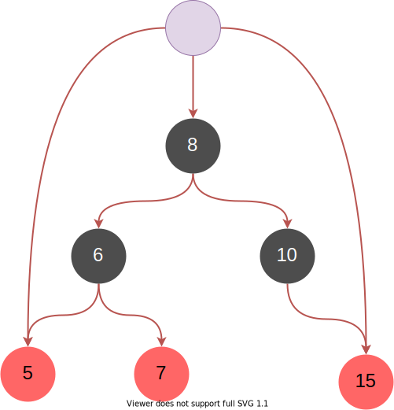

# 1 关联容器简介
&emsp;&emsp;关联容器即数据在存储还是访问上没有明确的前后关系，虽然实际操作时可以通过```++```之类的操作符移动迭代器访问下一个元素，但是这只是特定容器内定的顺序而已，实际上只存在最大值和最小值。标准STl的关联容器有:```set,map,multiset,multimap```等，SGI-STL额外实现了基于```hash_table```的```has_set,hash_map,hash_multiset,hash_multimap```。
&emsp;&emsp;STL中关联容器主要通过RBTree实现。
- 关联容器是红黑树实现，无序关联容器是哈希表实现。
- 关联容器保证按键值有序遍历，因此可以做范围查找，而无序关联容器不可以。关联支持一些导航类的操作，如求出给定键最邻近的键，最大键、最小键操作。
- 关联容器的迭代器不会失效，除非所指元素被删除。无序关联容器的iterator在修改元素时可能会失效。所以对关联容器的遍历与修改在一定程度上可并行。


# 2 红黑树
&emsp;&emsp;红黑树是STL中实现大多数容器的基本数据结构。红黑树（英语：Red–black tree）是一种自平衡二叉查找树，它的结构复杂，但它的操作有着良好的最坏情况运行时间，并且在实践中高效：它可以在时间$O(nlog_n)$内完成查找、插入和删除。红黑树是每个节点都带有颜色属性的二叉查找树，颜色为红色或黑色。在二叉查找树强制一般要求以外，对于任何有效的红黑树增加了如下的额外要求：
1. 节点要么是红色要么是黑色；
2. 根节点是黑色；
3. 所有叶子节点是黑色；
4. 每个红色节点必须有两个黑色的子节点；
5. 从任一节点到其每个叶子的所有简单路径都包含相同数目的黑色节点。

> 这里不会特别纠结红黑树的实现方式，和具体的原理，只会稍微提一下
## 2.1 红黑树数据结构
&emsp;&emsp;红黑树最基本的节点数据如下图所示，每个节点保存了三个指针分别指向父节点，右子节点，左子节点，是一个典型的二叉树结构。
```cpp
struct __rb_tree_node_base
{
  typedef __rb_tree_color_type color_type;
  typedef __rb_tree_node_base* base_ptr;

  color_type color; 
  base_ptr parent;
  base_ptr left;
  base_ptr right;

  static base_ptr minimum(base_ptr x)                                                                     //给定子树的最小值，最左子节点
  {
    while (x->left != 0) x = x->left;
    return x;
  }

  static base_ptr maximum(base_ptr x)                                                                     //给定子树的最大值，最右子节点
  {
    while (x->right != 0) x = x->right;
    return x;
  }
};

template <class Value>
struct __rb_tree_node : public __rb_tree_node_base
{
  typedef __rb_tree_node<Value>* link_type;
  Value value_field;
};
```
&emsp;&emsp;如下为最基本的红黑树的实现，该结构保存了一个header，用来指向红黑树的开头，结尾和根节点。
```cpp
template <class Key, class Value, class KeyOfValue, class Compare,
          class Alloc = alloc>
class rb_tree {
protected:
  typedef void* void_pointer;
  typedef __rb_tree_node_base* base_ptr;
  typedef __rb_tree_node<Value> rb_tree_node;
  typedef simple_alloc<rb_tree_node, Alloc> rb_tree_node_allocator;
  typedef __rb_tree_color_type color_type;
public:
  typedef Key key_type;
  typedef Value value_type;
  typedef value_type* pointer;
  typedef const value_type* const_pointer;
  typedef value_type& reference;
  typedef const value_type& const_reference;
  typedef rb_tree_node* link_type;
  typedef size_t size_type;
  typedef ptrdiff_t difference_type;
protected:
  size_type node_count; // keeps track of size of tree
  link_type header;                                                                           //header类似于一个链表的头节点，parent指向树的根节点，left指向最左子节点，right指向最右子节点
  Compare key_compare;
```


&emsp;&emsp;红黑树的迭代器相比较比较简单，主要是如何快速的找到前驱和后继节点。因为树中存在一个头节点可以指向开头结尾和根节点，因此相关实现也会简单些。
```cpp
struct __rb_tree_base_iterator                                                                              //红黑树迭代器定义
{
  typedef __rb_tree_node_base::base_ptr base_ptr;
  typedef bidirectional_iterator_tag iterator_category;
  typedef ptrdiff_t difference_type;
  base_ptr node;

  void increment()                                                                                          //迭代器指向的下一个节点是树的中序遍历的下一个节点
  {
    if (node->right != 0) {                       //寻找右子树的最左子节点
      node = node->right;
      while (node->left != 0)
        node = node->left;
    }
    else {                                        //当右子树为空时，分为两种情况，若当前节点为父节点的左子节点，则后驱结点应当是父节点，否则为第一个不为右子节点的祖先节点
      base_ptr y = node->parent;
      while (node == y->right) {
        node = y;
        y = y->parent;
      }
      if (node->right != y)
        node = y;
    }
  }

  void decrement()                                                                                          //前驱节点应当是中序遍历的前一个节点
  {
    if (node->color == __rb_tree_red &&               //针对end()的特殊处理，
        node->parent->parent == node)
      node = node->right;
    else if (node->left != 0) {                 //寻找左子树的最右子节点
      base_ptr y = node->left;
      while (y->right != 0)
        y = y->right;
      node = y;
    }
    else {                                    //当左子树为空，当当前节点为父节点的左子树时找到第一个使当前节点不为左子节点的祖先节点，便是前驱
      base_ptr y = node->parent;
      while (node == y->left) {
        node = y;
        y = y->parent;
      }
      node = y;
    }
  }
};
```

## 2.2 红黑树的插入和删除
&emsp;&emsp;红黑树的插入和删除可能会破坏树本身的结构，因此需要进行旋转，左旋转和右旋转的代码比较简单这里不会列出来。主要是插入比较复杂，一般分为几种情况（插入的节点默认是红色）：
1. 插入节点位置的父节点和父节点的兄弟节点均为红色，则需要进行颜色的反转；
2. 插入位置为左子树内插，则需要先左旋转后右旋转；
3. 插入位置为左子树的外插，则需要右旋转；
4. 插入位置为右子树的内插，则需要先右旋转后左旋转；
5. 插入位置为右子树的外插，则需要左旋转。

```cpp
inline void 
__rb_tree_rebalance(__rb_tree_node_base* x, __rb_tree_node_base*& root)                                                             //插入完节点之后进行rbtree的重平衡操作，保证符合rbtree的条件x为插入的节点
{
  x->color = __rb_tree_red;                         //插入节点首先设置为红色
  while (x != root && x->parent->color == __rb_tree_red) {                              //如果一直存在双红的情况则一直进行调整
    if (x->parent == x->parent->parent->left) {                              //如果当前节点的父结点为祖先节点的左子节点
      __rb_tree_node_base* y = x->parent->parent->right;
      if (y && y->color == __rb_tree_red) {                   //如果父节点及父节点的兄弟节点同为红色，则反转颜色
        x->parent->color = __rb_tree_black;
        y->color = __rb_tree_black;
        x->parent->parent->color = __rb_tree_red;
        x = x->parent->parent;                  //不断向上回溯，直到节点符合红黑树的条件
      }
      else {
        if (x == x->parent->right) {                          //当前节点为父节点的右子节点，即左子树内插，则需要先左旋转后右旋转
          x = x->parent;
          __rb_tree_rotate_left(x, root);
        }
        x->parent->color = __rb_tree_black;
        x->parent->parent->color = __rb_tree_red;
        __rb_tree_rotate_right(x->parent->parent, root);
      }
    }
    else {                                                                  //如果当前节点的父结点为祖先节点的右子节点
      __rb_tree_node_base* y = x->parent->parent->left;
      if (y && y->color == __rb_tree_red) {                   //如果父节点及父节点的兄弟节点同为红色，则反转颜色
        x->parent->color = __rb_tree_black;
        y->color = __rb_tree_black;
        x->parent->parent->color = __rb_tree_red;
        x = x->parent->parent;
      }
      else {
        if (x == x->parent->left) {                         //当前节点为父节点的右子节点，即右子树内插，则需要先右旋转后左旋转
          x = x->parent;
          __rb_tree_rotate_right(x, root);
        }
        x->parent->color = __rb_tree_black;
        x->parent->parent->color = __rb_tree_red;
        __rb_tree_rotate_left(x->parent->parent, root);
      }
    }
  }
  root->color = __rb_tree_black;
}
```
&emsp;&emsp;红黑树的删除问题比较复杂，这里不做讨论，毕竟不是专门讲红黑树的内容。稍微提一下，删除红黑树的节点，因为删除后要寻找前驱或者后继节点，完全可以将对应的元素进行交换转换成删除叶子节点，这样会方便很多。

# 3 
# 4
# 5
# 6